# 📐 Estándares y Convenciones del Proyecto

**Documento de Referencia para Desarrollo Consistente**  
**Versión**: 1.0  
**Última actualización**: Noviembre 2025

---

## 📋 Índice
1. [Arquitectura General](#arquitectura)
2. [Convenciones de Base de Datos](#base-datos)
3. [Estructura Backend (Python/FastAPI)](#backend)
4. [Estructura Frontend (Flutter)](#frontend)
5. [Naming Conventions](#naming)
6. [Patrones de Código](#patrones)
7. [Validaciones y Errores](#validaciones)
8. [Testing](#testing)
9. [Checklist de Módulo Completo](#checklist)

---

## 🏗️ Arquitectura General {#arquitectura}

### Stack Tecnológico Obligatorio
```yaml
Backend:
  Framework: FastAPI
  ORM: SQLAlchemy
  Base de datos: PostgreSQL
  Migraciones: Alembic
  Validación: Pydantic
  Autenticación: JWT (python-jose)
  Password: bcrypt (passlib)

Frontend:
  Framework: Flutter
  HTTP Client: Dio
  State Management: Riverpod
  Storage: flutter_secure_storage
  Serialización: json_annotation + build_runner

Comunicación:
  Formato: JSON con snake_case
  Protocolo: HTTPS/TLS
  Autenticación: JWT Bearer Token
```

---

## 🗄️ Convenciones de Base de Datos {#base-datos}

### 1. Nomenclatura de Tablas

```sql
-- ✅ CORRECTO: Plural, snake_case
CREATE TABLE licitaciones (...);
CREATE TABLE ampliaciones (...);
CREATE TABLE interacciones_cliente (...);

-- ❌ INCORRECTO
CREATE TABLE Licitacion (...);  -- No usar PascalCase
CREATE TABLE licitacion (...);   -- No usar singular
```

### 2. Nomenclatura de Columnas

```sql
-- ✅ CORRECTO: snake_case
licitacion_id SERIAL PRIMARY KEY
nombre_licitacion VARCHAR(255)
fecha_presentacion DATE
monto_ofertado DECIMAL(15, 2)
is_active BOOLEAN
created_at TIMESTAMP
updated_at TIMESTAMP

-- ❌ INCORRECTO
LicitacionId      -- No usar PascalCase
licitacionId      -- No usar camelCase
```

### 3. Estructura OBLIGATORIA de Toda Tabla

**Campos de Identificación:**
```sql
{tabla}_id SERIAL PRIMARY KEY  -- Siempre termina en _id
```

**Campos de Auditoría (OBLIGATORIOS en todas las tablas):**
```sql
is_active BOOLEAN DEFAULT TRUE
created_at TIMESTAMP DEFAULT CURRENT_TIMESTAMP
updated_at TIMESTAMP DEFAULT CURRENT_TIMESTAMP
created_by INTEGER REFERENCES users(user_id)
updated_by INTEGER REFERENCES users(user_id)  -- Opcional
```

**Excepciones a auditoría completa:**
- Tablas de relación muchos-a-muchos (solo `created_at`)
- Tablas de configuración (agregar `updated_at` pero no `created_by`)

### 4. Convenciones de Foreign Keys

```sql
-- ✅ CORRECTO: Mismo nombre que la PK referenciada
cliente_id INTEGER REFERENCES clientes(cliente_id)
licitacion_id INTEGER REFERENCES licitaciones(licitacion_id)
user_id INTEGER REFERENCES users(user_id)

-- ❌ INCORRECTO
cliente INTEGER REFERENCES clientes(cliente_id)  -- Falta _id
id_cliente INTEGER REFERENCES clientes(cliente_id)  -- Orden invertido
```

### 5. Índices Obligatorios

```sql
-- SIEMPRE crear índices en:
CREATE INDEX idx_{tabla}_{columna} ON {tabla}({columna});

-- Foreign Keys
CREATE INDEX idx_licitaciones_cliente ON licitaciones(cliente_id);

-- Fechas usadas en queries
CREATE INDEX idx_documentos_vencimiento ON documentos(fecha_vencimiento);

-- Estados
CREATE INDEX idx_licitaciones_estado ON licitaciones(estado_licitacion);

-- Búsquedas de texto
CREATE INDEX idx_licitaciones_numero ON licitaciones(numero_licitacion);
```

### 6. Constraints y Validaciones

```sql
-- CHECK constraints para validaciones de negocio
CONSTRAINT check_monto_positivo CHECK (monto_ofertado >= 0)
CONSTRAINT check_fechas CHECK (fecha_fin > fecha_inicio)

-- UNIQUE constraints
CONSTRAINT uq_cliente_email UNIQUE(cliente_id, email)

-- NOT NULL solo para campos realmente obligatorios
nombre_licitacion VARCHAR(255) NOT NULL
```

### 7. Tipos de Datos Estándar

```sql
-- Identificadores
SERIAL o INTEGER para IDs

-- Texto
VARCHAR(50)   -- Campos cortos (códigos, estados)
VARCHAR(100)  -- Campos medianos (nombres cortos)
VARCHAR(255)  -- Campos largos (nombres, títulos)
TEXT          -- Descripciones, observaciones, notas

-- Números
INTEGER       -- Enteros
DECIMAL(15, 2)  -- Montos (siempre 15,2)
NUMERIC(5, 2)   -- Porcentajes

-- Fechas
DATE          -- Solo fecha
TIME          -- Solo hora
TIMESTAMP     -- Fecha y hora (usar con timezone=True en SQLAlchemy)

-- Booleanos
BOOLEAN DEFAULT TRUE/FALSE

-- Arrays (usar con moderación)
TEXT[]        -- Array de strings
INTEGER[]     -- Array de enteros
```

---

## 💻 Estructura Backend (Python/FastAPI) {#backend}

### 1. Estructura de Archivos por Módulo

```
app/
├── models/
│   └── {modulo}.py                    # Modelo SQLAlchemy
├── schemas/
│   └── {modulo}.py                    # Schemas Pydantic
├── services/
│   └── {modulo}_service.py            # Lógica de negocio
├── api/v1/endpoints/
│   └── {modulo}s.py                   # Endpoints (plural)
└── utils/
    └── {modulo}_utils.py              # Utilidades específicas
```

### 2. Template de Modelo SQLAlchemy

```python
# app/models/{modulo}.py
from sqlalchemy import Column, Integer, String, Text, Boolean, DateTime, ForeignKey, Numeric, Date
from sqlalchemy.sql import func
from sqlalchemy.orm import relationship
from app.database import Base

class {Modulo}(Base):
    __tablename__ = "{modulos}"  # Plural, snake_case
    
    # Primary Key (OBLIGATORIO)
    {modulo}_id = Column(Integer, primary_key=True, index=True)
    
    # Foreign Keys (si aplica)
    licitacion_id = Column(Integer, ForeignKey("licitaciones.licitacion_id"), index=True)
    cliente_id = Column(Integer, ForeignKey("clientes.cliente_id"))
    
    # Campos del modelo
    nombre_{modulo} = Column(String(255), nullable=False)
    descripcion = Column(Text)
    estado_{modulo} = Column(String(50), default='activo', index=True)
    
    # Campos numéricos (si aplica)
    monto = Column(Numeric(15, 2))
    
    # Campos de fecha (si aplica)
    fecha_inicio = Column(Date)
    fecha_fin = Column(Date)
    
    # Auditoría (OBLIGATORIO)
    is_active = Column(Boolean, default=True)
    created_at = Column(DateTime(timezone=True), server_default=func.now())
    updated_at = Column(DateTime(timezone=True), onupdate=func.now())
    created_by = Column(Integer, ForeignKey("users.user_id"))
    updated_by = Column(Integer, ForeignKey("users.user_id"))
    
    # Relaciones (SIEMPRE usar back_populates)
    licitacion = relationship("Licitacion", back_populates="{modulos}")
    created_by_user = relationship("User", foreign_keys=[created_by])
    updated_by_user = relationship("User", foreign_keys=[updated_by])
```

### 3. Template de Schemas Pydantic

```python
# app/schemas/{modulo}.py
from pydantic import BaseModel, Field, validator
from typing import Optional, List
from datetime import datetime, date
from decimal import Decimal

class {Modulo}Base(BaseModel):
    """Schema base con campos comunes"""
    nombre_{modulo}: str = Field(..., max_length=255)
    descripcion: Optional[str] = None
    estado_{modulo}: str = Field(default='activo')
    fecha_inicio: Optional[date] = None
    monto: Optional[Decimal] = Field(None, ge=0)
    
    @validator('estado_{modulo}')
    def validate_estado(cls, v):
        estados_validos = ['activo', 'inactivo', 'pendiente']
        if v not in estados_validos:
            raise ValueError(f'Estado debe ser uno de: {", ".join(estados_validos)}')
        return v

class {Modulo}Create({Modulo}Base):
    """Schema para creación (sin ID)"""
    licitacion_id: Optional[int] = None

class {Modulo}Update(BaseModel):
    """Schema para actualización (todos opcionales)"""
    nombre_{modulo}: Optional[str] = None
    descripcion: Optional[str] = None
    estado_{modulo}: Optional[str] = None
    is_active: Optional[bool] = None

class {Modulo}Response({Modulo}Base):
    """Schema para respuesta (incluye ID y auditoría)"""
    {modulo}_id: int
    licitacion_id: Optional[int]
    is_active: bool
    created_at: datetime
    updated_at: Optional[datetime]
    created_by: int
    updated_by: Optional[int]
    
    class Config:
        from_attributes = True  # Para SQLAlchemy 2.0
```

### 4. Template de Service

```python
# app/services/{modulo}_service.py
from sqlalchemy.orm import Session
from sqlalchemy import and_, or_
from typing import List, Optional
from datetime import date

from app.models.{modulo} import {Modulo}
from app.schemas.{modulo} import {Modulo}Create, {Modulo}Update

class {Modulo}Service:
    
    @staticmethod
    def get_{modulos}(
        db: Session,
        skip: int = 0,
        limit: int = 100,
        estado: Optional[str] = None,
        licitacion_id: Optional[int] = None
    ) -> List[{Modulo}]:
        """Obtener {modulos} con filtros"""
        query = db.query({Modulo}).filter({Modulo}.is_active == True)
        
        if estado:
            query = query.filter({Modulo}.estado_{modulo} == estado)
        
        if licitacion_id:
            query = query.filter({Modulo}.licitacion_id == licitacion_id)
        
        return query.order_by({Modulo}.created_at.desc()).offset(skip).limit(limit).all()
    
    @staticmethod
    def get_{modulo}_by_id(db: Session, {modulo}_id: int) -> Optional[{Modulo}]:
        """Obtener {modulo} por ID"""
        return db.query({Modulo}).filter(
            {Modulo}.{modulo}_id == {modulo}_id,
            {Modulo}.is_active == True
        ).first()
    
    @staticmethod
    def create_{modulo}(
        db: Session,
        {modulo}_data: {Modulo}Create,
        user_id: int
    ) -> {Modulo}:
        """Crear nuevo {modulo}"""
        db_{modulo} = {Modulo}(
            **{modulo}_data.model_dump(),
            created_by=user_id
        )
        db.add(db_{modulo})
        db.commit()
        db.refresh(db_{modulo})
        return db_{modulo}
    
    @staticmethod
    def update_{modulo}(
        db: Session,
        {modulo}_id: int,
        {modulo}_data: {Modulo}Update,
        user_id: int
    ) -> Optional[{Modulo}]:
        """Actualizar {modulo}"""
        {modulo} = {Modulo}Service.get_{modulo}_by_id(db, {modulo}_id)
        if not {modulo}:
            return None
        
        update_data = {modulo}_data.model_dump(exclude_unset=True)
        for field, value in update_data.items():
            setattr({modulo}, field, value)
        
        {modulo}.updated_by = user_id
        db.commit()
        db.refresh({modulo})
        return {modulo}
    
    @staticmethod
    def delete_{modulo}(db: Session, {modulo}_id: int) -> bool:
        """Eliminar {modulo} (soft delete)"""
        {modulo} = {Modulo}Service.get_{modulo}_by_id(db, {modulo}_id)
        if not {modulo}:
            return False
        
        {modulo}.is_active = False
        db.commit()
        return True
```

### 5. Template de Endpoints

```python
# app/api/v1/endpoints/{modulos}.py
from fastapi import APIRouter, Depends, HTTPException, status, Query
from sqlalchemy.orm import Session
from typing import List, Optional

from app.database import get_db
from app.models.user import User
from app.schemas.{modulo} import {Modulo}Create, {Modulo}Update, {Modulo}Response
from app.services.{modulo}_service import {Modulo}Service
from app.api.deps import get_current_user, require_role

router = APIRouter()

@router.get("/", response_model=List[{Modulo}Response])
def get_{modulos}(
    skip: int = Query(0, ge=0),
    limit: int = Query(100, ge=1, le=500),
    estado: Optional[str] = None,
    licitacion_id: Optional[int] = None,
    db: Session = Depends(get_db),
    current_user: User = Depends(get_current_user)
):
    """Listar {modulos} con filtros"""
    {modulos} = {Modulo}Service.get_{modulos}(
        db=db,
        skip=skip,
        limit=limit,
        estado=estado,
        licitacion_id=licitacion_id
    )
    return {modulos}

@router.get("/{{{modulo}_id}}", response_model={Modulo}Response)
def get_{modulo}(
    {modulo}_id: int,
    db: Session = Depends(get_db),
    current_user: User = Depends(get_current_user)
):
    """Obtener {modulo} por ID"""
    {modulo} = {Modulo}Service.get_{modulo}_by_id(db, {modulo}_id)
    if not {modulo}:
        raise HTTPException(status_code=404, detail="{Modulo} no encontrado")
    return {modulo}

@router.post("/", response_model={Modulo}Response, status_code=status.HTTP_201_CREATED)
def create_{modulo}(
    {modulo}_data: {Modulo}Create,
    db: Session = Depends(get_db),
    current_user: User = Depends(get_current_user)
):
    """Crear nuevo {modulo}"""
    try:
        {modulo} = {Modulo}Service.create_{modulo}(
            db=db,
            {modulo}_data={modulo}_data,
            user_id=current_user.user_id
        )
        return {modulo}
    except Exception as e:
        raise HTTPException(status_code=400, detail=str(e))

@router.put("/{{{modulo}_id}}", response_model={Modulo}Response)
def update_{modulo}(
    {modulo}_id: int,
    {modulo}_data: {Modulo}Update,
    db: Session = Depends(get_db),
    current_user: User = Depends(get_current_user)
):
    """Actualizar {modulo}"""
    {modulo} = {Modulo}Service.update_{modulo}(
        db=db,
        {modulo}_id={modulo}_id,
        {modulo}_data={modulo}_data,
        user_id=current_user.user_id
    )
    if not {modulo}:
        raise HTTPException(status_code=404, detail="{Modulo} no encontrado")
    return {modulo}

@router.delete("/{{{modulo}_id}}", status_code=status.HTTP_204_NO_CONTENT)
def delete_{modulo}(
    {modulo}_id: int,
    db: Session = Depends(get_db),
    current_user: User = Depends(get_current_user)
):
    """Eliminar {modulo}"""
    success = {Modulo}Service.delete_{modulo}(db, {modulo}_id)
    if not success:
        raise HTTPException(status_code=404, detail="{Modulo} no encontrado")
    return None
```

---

## 📱 Estructura Frontend (Flutter) {#frontend}

### 1. Estructura de Archivos por Módulo

```
lib/
├── data/
│   ├── models/
│   │   └── {modulo}_model.dart
│   └── repositories/
│       └── {modulo}_repository.dart
└── presentation/
    └── screens/
        └── {modulos}/
            ├── {modulos}_list_screen.dart
            ├── {modulo}_detail_screen.dart
            └── {modulo}_form_screen.dart
```

### 2. Template de Modelo Dart

```dart
// lib/data/models/{modulo}_model.dart
import 'package:json_annotation/json_annotation.dart';
import 'package:flutter/material.dart';

part '{modulo}_model.g.dart';

@JsonSerializable(fieldRename: FieldRename.snake)
class {Modulo}Model {
  final int {modulo}Id;
  final int? licitacionId;
  final String nombre{Modulo};
  final String? descripcion;
  final String estado{Modulo};
  final DateTime? fechaInicio;
  final double? monto;
  final bool isActive;
  final DateTime createdAt;
  final DateTime? updatedAt;

  {Modulo}Model({
    required this.{modulo}Id,
    this.licitacionId,
    required this.nombre{Modulo},
    this.descripcion,
    required this.estado{Modulo},
    this.fechaInicio,
    this.monto,
    required this.isActive,
    required this.createdAt,
    this.updatedAt,
  });

  factory {Modulo}Model.fromJson(Map<String, dynamic> json) =>
      _${Modulo}ModelFromJson(json);

  Map<String, dynamic> toJson() => _${Modulo}ModelToJson(this);

  // Helpers de visualización
  String get estadoFormatted {
    final estados = {
      'activo': 'Activo',
      'inactivo': 'Inactivo',
      'pendiente': 'Pendiente',
    };
    return estados[estado{Modulo}] ?? estado{Modulo};
  }

  Color getEstadoColor() {
    switch (estado{Modulo}) {
      case 'activo':
        return Colors.green;
      case 'inactivo':
        return Colors.grey;
      case 'pendiente':
        return Colors.orange;
      default:
        return Colors.grey;
    }
  }
}
```

### 3. Template de Repository Dart

```dart
// lib/data/repositories/{modulo}_repository.dart
import '../data_sources/api_client.dart';
import '../models/{modulo}_model.dart';
import '../../core/config/api_config.dart';

class {Modulo}Repository {
  final ApiClient _apiClient;

  {Modulo}Repository(this._apiClient);

  Future<List<{Modulo}Model>> get{Modulos}({
    int skip = 0,
    int limit = 100,
    String? estado,
    int? licitacionId,
  }) async {
    try {
      final queryParams = {
        'skip': skip.toString(),
        'limit': limit.toString(),
      };

      if (estado != null) queryParams['estado'] = estado;
      if (licitacionId != null) queryParams['licitacion_id'] = licitacionId.toString();

      final response = await _apiClient.dio.get(
        ApiConfig.{modulos},
        queryParameters: queryParams,
      );

      return (response.data as List)
          .map((json) => {Modulo}Model.fromJson(json))
          .toList();
    } catch (e) {
      throw Exception('Error al obtener {modulos}: $e');
    }
  }

  Future<{Modulo}Model> get{Modulo}(int {modulo}Id) async {
    try {
      final response = await _apiClient.dio.get(
        '${ApiConfig.{modulos}}/${modulo}Id',
      );
      return {Modulo}Model.fromJson(response.data);
    } catch (e) {
      throw Exception('Error al obtener {modulo}: $e');
    }
  }

  Future<{Modulo}Model> create{Modulo}(Map<String, dynamic> data) async {
    try {
      final response = await _apiClient.dio.post(
        ApiConfig.{modulos},
        data: data,
      );
      return {Modulo}Model.fromJson(response.data);
    } catch (e) {
      throw Exception('Error al crear {modulo}: $e');
    }
  }

  Future<{Modulo}Model> update{Modulo}(
    int {modulo}Id,
    Map<String, dynamic> data,
  ) async {
    try {
      final response = await _apiClient.dio.put(
        '${ApiConfig.{modulos}}/${modulo}Id',
        data: data,
      );
      return {Modulo}Model.fromJson(response.data);
    } catch (e) {
      throw Exception('Error al actualizar {modulo}: $e');
    }
  }

  Future<void> delete{Modulo}(int {modulo}Id) async {
    try {
      await _apiClient.dio.delete(
        '${ApiConfig.{modulos}}/${modulo}Id',
      );
    } catch (e) {
      throw Exception('Error al eliminar {modulo}: $e');
    }
  }
}
```

---

## 🏷️ Naming Conventions {#naming}

### Python/Backend

```python
# Clases: PascalCase
class LicitacionService:
class UserModel:

# Funciones y variables: snake_case
def get_licitaciones():
user_id = 123
fecha_vencimiento = date.today()

# Constantes: UPPER_SNAKE_CASE
MAX_FILE_SIZE = 10485760
DEFAULT_ESTADO = "activo"

# Archivos: snake_case
licitacion_service.py
documento_utils.py
```

### Dart/Frontend

```dart
// Clases: PascalCase
class LicitacionModel
class UserRepository

// Variables y funciones: camelCase
int licitacionId = 123;
String nombreLicitacion = "";
void getLicitaciones() {}

// Constantes: lowerCamelCase
const int maxFileSize = 10485760;
const String defaultEstado = "activo";

// Archivos: snake_case
licitacion_model.dart
user_repository.dart
```

### API/JSON

```json
{
  "licitacion_id": 123,
  "numero_licitacion": "LIC-2025-001",
  "nombre_licitacion": "Consultoría TI",
  "fecha_presentacion": "2025-01-15",
  "monto_ofertado": 50000.00,
  "is_active": true,
  "created_at": "2025-01-01T10:00:00Z"
}
```

---

## 🔧 Patrones de Código {#patrones}

### 1. Manejo de Errores (Backend)

```python
# ✅ CORRECTO
try:
    resultado = operacion_riesgosa()
except ValueError as e:
    raise HTTPException(status_code=400, detail=str(e))
except Exception as e:
    logger.error(f"Error inesperado: {e}")
    raise HTTPException(status_code=500, detail="Error interno del servidor")

# ❌ INCORRECTO
try:
    resultado = operacion_riesgosa()
except:  # No capturar Exception genérico sin especificar
    pass  # Nunca ignorar errores silenciosamente
```

### 2. Manejo de Errores (Flutter)

```dart
// ✅ CORRECTO
try {
  final resultado = await repository.obtenerDatos();
  return resultado;
} catch (e) {
  if (mounted) {
    ScaffoldMessenger.of(context).showSnackBar(
      SnackBar(content: Text('Error: ${e.toString()}')),
    );
  }
  rethrow;
}

// ❌ INCORRECTO
try {
  final resultado = await repository.obtenerDatos();
} catch (e) {
  // No hacer nada silenciosamente
}
```

### 3. Validaciones (Backend)

```python
# ✅ CORRECTO: Usar validators de Pydantic
@validator('monto')
def validate_monto(cls, v):
    if v is not None and v < 0:
        raise ValueError('El monto debe ser positivo')
    return v

@validator('fecha_fin')
def validate_fecha_fin(cls, v, values):
    if v and 'fecha_inicio' in values and values['fecha_inicio']:
        if v <= values['fecha_inicio']:
            raise ValueError('Fecha fin debe ser mayor a fecha inicio')
    return v
```

### 4. Queries Complejos (Backend)

```python
# ✅ CORRECTO: Usar Service layer
query = db.query(Licitacion).filter(
    and_(
        Licitacion.is_active == True,
        Licitacion.estado_licitacion.in_(['activa', 'pendiente'])
    )
)

# Filtros opcionales
if fecha_desde:
    query = query.filter(Licitacion.fecha_presentacion >= fecha_desde)

# ❌ INCORRECTO: Queries directos en endpoints
licitaciones = db.query(Licitacion).all()  # Sin filtros ni paginación
```

---

## ✅ Validaciones y Errores {#validaciones}

### Códigos de Estado HTTP Estándar

```python
# Éxito
200 OK - GET, PUT exitoso
201 Created - POST exitoso
204 No Content - DELETE exitoso

# Errores del cliente
400 Bad Request - Datos inválidos
401 Unauthorized - No autenticado
403 Forbidden - Sin permisos
404 Not Found - Recurso no encontrado
409 Conflict - Conflicto (ej: duplicado)

# Errores del servidor
500 Internal Server Error - Error no manejado
```

### Formato de Respuesta Estándar

```json
// ✅ Éxito
{
  "licitacion_id": 123,
  "nombre_licitacion": "..."
}

// ✅ Error
{
  "detail": "Licitación no encontrada"
}

// ✅ Validación múltiple
{
  "detail": [
    {
      "loc": ["body", "monto"],
      "msg": "El monto debe ser positivo",
      "type": "value_error"
    }
  ]
}
```

---

## 🧪 Testing {#testing}

### Template de Test (Backend)

```python
# tests/test_{modulos}.py
import pytest
from fastapi.testclient import TestClient

def test_create_{modulo}(client, auth_token):
    response = client.post(
        "/api/v1/{modulos}/",
        headers={"Authorization": f"Bearer {auth_token}"},
        json={
            "nombre_{modulo}": "Test",
            "descripcion": "Descripción de prueba"
        }
    )
    assert response.status_code == 201
    assert response.json()["nombre_{modulo}"] == "Test"

def test_get_{modulos}(client, auth_token):
    response = client.get(
        "/api/v1/{modulos}/",
        headers={"Authorization": f"Bearer {auth_token}"}
    )
    assert response.status_code == 200
    assert isinstance(response.json(), list)

def test_get_{modulo}_not_found(client, auth_token):
    response = client.get(
        "/api/v1/{modulos}/99999",
        headers={"Authorization": f"Bearer {auth_token}"}
    )
    assert response.status_code == 404
```

---

## ✅ Checklist de Módulo Completo {#checklist}

### Backend
- [ ] Tabla en base de datos con campos de auditoría
- [ ] Índices en FKs, estados y campos de búsqueda
- [ ] Modelo SQLAlchemy con relationships
- [ ] Schemas: Base, Create, Update, Response
- [ ] Validators en schemas
- [ ] Service con métodos: get_all, get_by_id, create, update, delete
- [ ] Endpoints con autenticación JWT
- [ ] Paginación en listados (skip, limit)
- [ ] Filtros opcionales
- [ ] Manejo de errores con HTTPException
- [ ] Soft delete (is_active)
- [ ] Tests unitarios básicos

### Frontend
- [ ] Modelo Dart con @JsonSerializable
- [ ] Archivo .g.dart generado
- [ ] Repository con CRUD completo
- [ ] Pantalla de lista con filtros
- [ ] Pantalla de detalle
- [ ] Pantalla de formulario (crear/editar)
- [ ] Validaciones de formulario
- [ ] Manejo de estados (loading, error, success)
- [ ] Navegación entre pantallas
- [ ] Indicadores visuales (colores por estado)
- [ ] Confirmación en eliminaciones

### Integración
- [ ] Endpoint registrado en router principal
- [ ] API client configurado para el módulo
- [ ] Constantes en ApiConfig
- [ ] Migración de Alembic creada y aplicada
- [ ] Relaciones bidireccionales funcionando
- [ ] Datos de prueba para testing
- [ ] Documentación Swagger generada
- [ ] CRUD completo probado end-to-end

---

## 📝 Plantillas de Código Listas para Usar

### Comando para Crear Nuevo Módulo (Backend)

```bash
# 1. Crear archivos
touch app/models/{modulo}.py
touch app/schemas/{modulo}.py
touch app/services/{modulo}_service.py
touch app/api/v1/endpoints/{modulos}.py
touch tests/test_{modulos}.py

# 2. Crear migración
alembic revision --autogenerate -m "Add {modulos} table"

# 3. Aplicar migración
alembic upgrade head

# 4. Registrar router en app/api/v1/__init__.py
```

### Comando para Crear Nuevo Módulo (Frontend)

```bash
# 1. Crear estructura
mkdir -p lib/data/models
mkdir -p lib/data/repositories
mkdir -p lib/presentation/screens/{modulos}

# 2. Crear archivos
touch lib/data/models/{modulo}_model.dart
touch lib/data/repositories/{modulo}_repository.dart
touch lib/presentation/screens/{modulos}/{modulos}_list_screen.dart
touch lib/presentation/screens/{modulos}/{modulo}_detail_screen.dart
touch lib/presentation/screens/{modulos}/{modulo}_form_screen.dart

# 3. Generar código
flutter pub run build_runner build --delete-conflicting-outputs

# 4. Agregar constante en lib/core/config/api_config.dart
```

---

## 🎨 Estándares de UI/UX (Flutter)

### 1. Colores por Estado

```dart
// Estados de licitación/documentos/etc
final estadoColors = {
  'activo': Colors.green,
  'inactivo': Colors.grey,
  'pendiente': Colors.orange,
  'aprobado': Colors.green,
  'rechazado': Colors.red,
  'vencido': Colors.red,
  'por_vencer': Colors.orange,
};
```

### 2. Iconos por Tipo

```dart
// Tipos de documentos/interacciones/etc
final tipoIcons = {
  'documento': Icons.description,
  'contrato': Icons.file_present,
  'garantia': Icons.account_balance,
  'reunion': Icons.people,
  'llamada': Icons.phone,
  'email': Icons.email,
  'visita': Icons.location_on,
};
```

### 3. Estructura de Card Estándar

```dart
Card(
  margin: const EdgeInsets.only(bottom: 12),
  child: InkWell(
    onTap: () => _navigateToDetail(context, item.id),
    borderRadius: BorderRadius.circular(12),
    child: Padding(
      padding: const EdgeInsets.all(16.0),
      child: Column(
        crossAxisAlignment: CrossAxisAlignment.start,
        children: [
          // Header con título y badge de estado
          Row(
            children: [
              Expanded(
                child: Text(
                  item.titulo,
                  style: Theme.of(context).textTheme.titleMedium?.copyWith(
                    fontWeight: FontWeight.bold,
                  ),
                ),
              ),
              _EstadoBadge(estado: item.estado),
            ],
          ),
          const SizedBox(height: 8),
          
          // Información secundaria
          Text(
            item.descripcion ?? '',
            maxLines: 2,
            overflow: TextOverflow.ellipsis,
          ),
          const SizedBox(height: 8),
          
          // Metadata (fecha, monto, etc)
          Row(
            children: [
              Icon(Icons.calendar_today, size: 14, color: Colors.grey),
              const SizedBox(width: 4),
              Text(
                _formatDate(item.fecha),
                style: TextStyle(fontSize: 12, color: Colors.grey),
              ),
              const Spacer(),
              if (item.monto != null)
                Text(
                  _formatMonto(item.monto!),
                  style: TextStyle(fontWeight: FontWeight.bold),
                ),
            ],
          ),
        ],
      ),
    ),
  ),
)
```

### 4. Formulario Estándar

```dart
Form(
  key: _formKey,
  child: ListView(
    padding: const EdgeInsets.all(16.0),
    children: [
      // Campo de texto obligatorio
      TextFormField(
        controller: _nombreController,
        decoration: const InputDecoration(
          labelText: 'Nombre *',
          border: OutlineInputBorder(),
          helperText: 'Campo obligatorio',
        ),
        validator: (value) {
          if (value == null || value.isEmpty) {
            return 'Campo requerido';
          }
          return null;
        },
      ),
      const SizedBox(height: 16),
      
      // Dropdown
      DropdownButtonFormField<String>(
        value: _estadoSeleccionado,
        decoration: const InputDecoration(
          labelText: 'Estado',
          border: OutlineInputBorder(),
        ),
        items: [
          DropdownMenuItem(value: 'activo', child: Text('Activo')),
          DropdownMenuItem(value: 'inactivo', child: Text('Inactivo')),
        ],
        onChanged: (value) => setState(() => _estadoSeleccionado = value),
      ),
      const SizedBox(height: 16),
      
      // Date picker
      InkWell(
        onTap: () => _selectFecha(context),
        child: InputDecorator(
          decoration: const InputDecoration(
            labelText: 'Fecha',
            border: OutlineInputBorder(),
            suffixIcon: Icon(Icons.calendar_today),
          ),
          child: Text(
            _fecha != null 
              ? '${_fecha!.day}/${_fecha!.month}/${_fecha!.year}'
              : 'Seleccionar fecha',
          ),
        ),
      ),
      const SizedBox(height: 32),
      
      // Botones de acción
      Row(
        children: [
          Expanded(
            child: OutlinedButton(
              onPressed: () => Navigator.pop(context),
              child: const Text('Cancelar'),
            ),
          ),
          const SizedBox(width: 16),
          Expanded(
            child: ElevatedButton(
              onPressed: _isLoading ? null : _submitForm,
              child: _isLoading
                ? const SizedBox(
                    height: 20,
                    width: 20,
                    child: CircularProgressIndicator(strokeWidth: 2),
                  )
                : const Text('Guardar'),
            ),
          ),
        ],
      ),
    ],
  ),
)
```

---

## 🔒 Seguridad Estándar

### 1. Autenticación (SIEMPRE)

```python
# Backend: Proteger TODOS los endpoints
@router.get("/")
def get_items(
    current_user: User = Depends(get_current_user)  # OBLIGATORIO
):
    pass

# Excepciones: Solo /auth/login y /health
```

```dart
// Flutter: Incluir token en TODAS las peticiones
final response = await _apiClient.dio.get(
  endpoint,
  // Token se agrega automáticamente por interceptor
);
```

### 2. Autorización por Roles

```python
# Backend: Usar require_role cuando sea necesario
@router.delete("/{item_id}")
def delete_item(
    current_user: User = Depends(require_role(["administrador"]))
):
    pass
```

### 3. Validación de Datos (SIEMPRE)

```python
# Backend: NUNCA confiar en datos del cliente
class ItemCreate(BaseModel):
    nombre: str = Field(..., min_length=1, max_length=255)
    monto: Decimal = Field(..., ge=0, le=999999999)
    
    @validator('nombre')
    def validate_nombre(cls, v):
        if not v.strip():
            raise ValueError('Nombre no puede estar vacío')
        return v.strip()
```

### 4. SQL Injection Prevention

```python
# ✅ CORRECTO: Usar ORM
db.query(Licitacion).filter(Licitacion.licitacion_id == id).first()

# ❌ INCORRECTO: NUNCA usar SQL raw con input del usuario
db.execute(f"SELECT * FROM licitaciones WHERE id = {id}")
```

---

## 📊 Paginación y Filtros Estándar

### Backend

```python
@router.get("/", response_model=List[ItemResponse])
def get_items(
    # Paginación (OBLIGATORIO en listados)
    skip: int = Query(0, ge=0),
    limit: int = Query(100, ge=1, le=500),
    
    # Ordenamiento
    order_by: str = Query("created_at"),
    order_direction: str = Query("desc", regex="^(asc|desc)$"),
    
    # Filtros específicos
    estado: Optional[str] = None,
    fecha_desde: Optional[date] = None,
    fecha_hasta: Optional[date] = None,
    
    # Búsqueda
    search: Optional[str] = None,
    
    db: Session = Depends(get_db),
    current_user: User = Depends(get_current_user)
):
    return service.get_items(
        db, skip, limit, estado, fecha_desde, fecha_hasta, search
    )
```

### Frontend

```dart
Future<List<ItemModel>> getItems({
  int page = 0,
  int pageSize = 20,
  String? estado,
  String? search,
}) async {
  final skip = page * pageSize;
  
  final queryParams = {
    'skip': skip.toString(),
    'limit': pageSize.toString(),
  };
  
  if (estado != null) queryParams['estado'] = estado;
  if (search != null && search.isNotEmpty) queryParams['search'] = search;
  
  final response = await _apiClient.dio.get(
    endpoint,
    queryParameters: queryParams,
  );
  
  return (response.data as List)
      .map((json) => ItemModel.fromJson(json))
      .toList();
}
```

---

## 🐛 Debugging y Logging

### Backend

```python
import logging

logger = logging.getLogger(__name__)

# Niveles de log
logger.debug("Información de debugging")
logger.info("Información general")
logger.warning("Advertencia")
logger.error("Error")
logger.critical("Error crítico")

# En excepciones
try:
    operation()
except Exception as e:
    logger.error(f"Error en operación: {e}", exc_info=True)
    raise
```

### Frontend

```dart
import 'package:logger/logger.dart';

final logger = Logger();

// Uso
logger.d('Debug message');
logger.i('Info message');
logger.w('Warning message');
logger.e('Error message', error: e, stackTrace: stackTrace);
```

---

## 📚 Documentación Obligatoria

### Docstrings (Backend)

```python
def create_item(
    db: Session,
    item_data: ItemCreate,
    user_id: int
) -> Item:
    """
    Crear nuevo item.
    
    Args:
        db: Sesión de base de datos
        item_data: Datos del item a crear
        user_id: ID del usuario que crea
        
    Returns:
        Item: Item creado con ID asignado
        
    Raises:
        ValueError: Si los datos son inválidos
    """
    pass
```

### Comentarios de Código

```python
# ✅ CORRECTO: Explicar el "por qué"
# Usamos soft delete para mantener historial de auditoría
item.is_active = False

# ❌ INCORRECTO: Explicar el "qué" (código auto-explicativo)
# Establece is_active en False
item.is_active = False
```

---

## 🎯 Reglas de Oro

1. **NUNCA** eliminar físicamente registros (siempre soft delete con `is_active`)
2. **SIEMPRE** incluir campos de auditoría (`created_at`, `created_by`, etc.)
3. **SIEMPRE** usar paginación en listados
4. **SIEMPRE** validar datos del cliente (backend Y frontend)
5. **SIEMPRE** proteger endpoints con autenticación
6. **SIEMPRE** usar `snake_case` en API/DB y `camelCase` en Dart
7. **NUNCA** hardcodear valores (usar constantes o configuración)
8. **SIEMPRE** manejar errores explícitamente
9. **SIEMPRE** crear índices en FKs y campos de búsqueda
10. **SIEMPRE** usar transacciones para operaciones múltiples

---

## 🔄 Workflow de Desarrollo

```mermaid
graph LR
    A[Diseñar DB] --> B[Crear Migración]
    B --> C[Modelo SQLAlchemy]
    C --> D[Schemas Pydantic]
    D --> E[Service Layer]
    E --> F[Endpoints]
    F --> G[Tests Backend]
    G --> H[Modelo Dart]
    H --> I[Repository Dart]
    I --> J[Pantallas Flutter]
    J --> K[Integración E2E]
    K --> L[Documentar]
```



---

## 📞 Contacto y Soporte

Cuando tengas dudas:
1. Consulta ESTE documento primero
2. Revisa módulos existentes como referencia
3. Verifica que cumples el checklist completo
4. Asegúrate de seguir TODOS los estándares

---

**✅ DOCUMENTO DE ESTÁNDARES COMPLETO**

**Última actualización**: Noviembre 2025  
**Versión**: 1.0

Este documento es la **ÚNICA FUENTE DE VERDAD** para el desarrollo de cualquier módulo nuevo en el sistema.