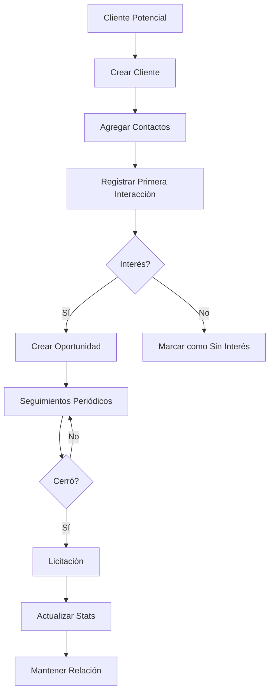

**lib/data/models/contacto_model.dart**
```dart
import 'package:json_annotation/json_annotation.dart';

part 'contacto_model.g.dart';

@JsonSerializable(fieldRename: FieldRename.snake)
class ContactoModel {
  final int contactoId;
  final int clienteId;
  final String nombreContacto;
  final String? cargo;
  final String? departamento;
  final String? telefono;
  final String? celular;
  final String? email;
  final bool esContactoPrincipal;
  final bool puedeFirmar;
  final String? nivelDecision;
  final String? notas;
  final DateTime createdAt;

  ContactoModel({
    required this.contactoId,
    required this.clienteId,
    required this.nombreContacto,
    this.cargo,
    this.departamento,
    this.telefono,
    this.celular,
    this.email,
    required this.esContactoPrincipal,
    required this.puedeFirmar,
    this.nivelDecision,
    this.notas,
    required this.createdAt,
  });

  factory ContactoModel.fromJson(Map<String, dynamic> json) =>
      _$ContactoModelFromJson(json);

  Map<String, dynamic> toJson() => _$ContactoModelToJson(this);
}
```

**lib/data/models/interaccion_cliente_model.dart**
```dart
import 'package:json_annotation/json_annotation.dart';

part 'interaccion_cliente_model.g.dart';

@JsonSerializable(fieldRename: FieldRename.snake)
class InteraccionClienteModel {
  final int interaccionId;
  final int clienteId;
  final int? contactoId;
  final String tipoInteraccion;
  final String titulo;
  final String descripcion;
  final DateTime fechaInteraccion;
  final int? duracionMinutos;
  final String? modalidad;
  final String? resultado;
  final int? nivelInteres;
  final bool requiereSeguimiento;
  final DateTime? fechaProximoSeguimiento;
  final String? accionSiguiente;
  final String? observaciones;
  final DateTime createdAt;

  InteraccionClienteModel({
    required this.interaccionId,
    required this.clienteId,
    this.contactoId,
    required this.tipoInteraccion,
    required this.titulo,
    required this.descripcion,
    required this.fechaInteraccion,
    this.duracionMinutos,
    this.modalidad,
    this.resultado,
    this.nivelInteres,
    required this.requiereSeguimiento,
    this.fechaProximoSeguimiento,
    this.accionSiguiente,
    this.observaciones,
    required this.createdAt,
  });

  factory InteraccionClienteModel.fromJson(Map<String, dynamic> json) =>
      _$InteraccionClienteModelFromJson(json);

  Map<String, dynamic> toJson() => _$InteraccionClienteModelToJson(this);

  String get tipoFormatted {
    final tipos = {
      'reunion': 'Reunión',
      'llamada': 'Llamada',
      'email': 'Email',
      'visita': 'Visita',
      'presentacion': 'Presentación',
      'cotizacion': 'Cotización',
      'seguimiento': 'Seguimiento',
    };
    return tipos[tipoInteraccion] ?? tipoInteraccion;
  }

  IconData getTipoIcon() {
    switch (tipoInteraccion) {
      case 'reunion':
        return Icons.people;
      case 'llamada':
        return Icons.phone;
      case 'email':
        return Icons.email;
      case 'visita':
        return Icons.location_on;
      case 'presentacion':
        return Icons.present_to_all;
      default:
        return Icons.chat;
    }
  }
}
```

### 2. Pantalla de Perfil de Cliente

**lib/presentation/screens/clientes/cliente_perfil_screen.dart**
```dart
import 'package:flutter/material.dart';

class ClientePerfilScreen extends StatelessWidget {
  final int clienteId;

  const ClientePerfilScreen({Key? key, required this.clienteId}) : super(key: key);

  @override
  Widget build(BuildContext context) {
    return DefaultTabController(
      length: 4,
      child: Scaffold(
        appBar: AppBar(
          title: const Text('Ministerio de Educación'),
          bottom: const TabBar(
            isScrollable: true,
            tabs: [
              Tab(text: 'Información'),
              Tab(text: 'Contactos'),
              Tab(text: 'Interacciones'),
              Tab(text: 'Licitaciones'),
            ],
          ),
          actions: [
            IconButton(
              icon: const Icon(Icons.edit),
              onPressed: () {
                // Editar cliente
              },
            ),
          ],
        ),
        body: TabBarView(
          children: [
            _InfoTab(),
            _ContactosTab(clienteId: clienteId),
            _InteraccionesTab(clienteId: clienteId),
            _LicitacionesTab(clienteId: clienteId),
          ],
        ),
      ),
    );
  }
}

class _InfoTab extends StatelessWidget {
  @override
  Widget build(BuildContext context) {
    return SingleChildScrollView(
      padding: const EdgeInsets.all(16),
      child: Column(
        crossAxisAlignment: CrossAxisAlignment.start,
        children: [
          // KPIs del cliente
          Row(
            children: [
              Expanded(
                child: _StatCard(
                  title: 'Licitaciones',
                  value: '24',
                  subtitle: 'Total',
                  icon: Icons.description,
                  color: Colors.blue,
                ),
              ),
              const SizedBox(width: 12),
              Expanded(
                child: _StatCard(
                  title: 'Ganadas',
                  value: '18',
                  subtitle: '75%',
                  icon: Icons.check_circle,
                  color: Colors.green,
                ),
              ),
            ],
          ),
          const SizedBox(height: 12),
          Row(
            children: [
              Expanded(
                child: _StatCard(
                  title: 'Monto Total',
                  value: '₡450M',
                  subtitle: 'Adjudicado',
                  icon: Icons.attach_money,
                  color: Colors.orange,
                ),
              ),
              const SizedBox(width: 12),
              Expanded(
                child: _StatCard(
                  title: 'Interacciones',
                  value: '56',
                  subtitle: 'Este año',
                  icon: Icons.forum,
                  color: Colors.purple,
                ),
              ),
            ],
          ),
          const SizedBox(height: 24),

          // Información general
          Card(
            child: Padding(
              padding: const EdgeInsets.all(16.0),
              child: Column(
                crossAxisAlignment: CrossAxisAlignment.start,
                children: [
                  Text(
                    'Información General',
                    style: Theme.of(context).textTheme.titleLarge,
                  ),
                  const SizedBox(height: 16),
                  _InfoRow(label: 'Tipo', value: 'Institución Pública'),
                  _InfoRow(label: 'Sector', value: 'Educación'),
                  _InfoRow(label: 'Cédula Jurídica', value: '3-101-123456'),
                  _InfoRow(label: 'Teléfono', value: '2222-3333'),
                  _InfoRow(label: 'Email', value: 'contacto@mep.go.cr'),
                  _InfoRow(
                    label: 'Dirección',
                    value: 'San José, Costa Rica',
                  ),
                  const Divider(height: 24),
                  _InfoRow(
                    label: 'Clasificación',
                    value: 'VIP',
                    valueColor: Colors.orange,
                  ),
                  _InfoRow(
                    label: 'Última Interacción',
                    value: '15/03/2025',
                  ),
                ],
              ),
            ),
          ),
          const SizedBox(height: 16),

          // Notas
          Card(
            child: Padding(
              padding: const EdgeInsets.all(16.0),
              child: Column(
                crossAxisAlignment: CrossAxisAlignment.start,
                children: [
                  Text(
                    'Notas',
                    style: Theme.of(context).textTheme.titleLarge,
                  ),
                  const SizedBox(height: 12),
                  const Text(
                    'Cliente prioritario. Excelente historial de pagos. '
                    'Contactar preferiblemente en horario de mañana.',
                  ),
                ],
              ),
            ),
          ),
        ],
      ),
    );
  }
}

class _ContactosTab extends StatelessWidget {
  final int clienteId;

  const _ContactosTab({required this.clienteId});

  @override
  Widget build(BuildContext context) {
    return Column(
      children: [
        Padding(
          padding: const EdgeInsets.all(16.0),
          child: Row(
            children: [
              Expanded(
                child: Text(
                  'Contactos',
                  style: Theme.of(context).textTheme.titleLarge,
                ),
              ),
              ElevatedButton.icon(
                onPressed: () => _showContactoForm(context),
                icon: const Icon(Icons.add),
                label: const Text('Agregar'),
              ),
            ],
          ),
        ),
        Expanded(
          child: ListView.builder(
            padding: const EdgeInsets.symmetric(horizontal: 16),
            itemCount: 3,
            itemBuilder: (context, index) {
              return _ContactoCard(
                nombre: 'Juan Pérez Mora',
                cargo: 'Director de Compras',
                telefono: '8888-9999',
                email: 'jperez@mep.go.cr',
                esPrincipal: index == 0,
              );
            },
          ),
        ),
      ],
    );
  }

  void _showContactoForm(BuildContext context) {
    // Mostrar formulario
  }
}

class _InteraccionesTab extends StatelessWidget {
  final int clienteId;

  const _InteraccionesTab({required this.clienteId});

  @override
  Widget build(BuildContext context) {
    return Column(
      children: [
        Padding(
          padding: const EdgeInsets.all(16.0),
          child: Row(
            children: [
              Expanded(
                child: Text(
                  'Historial de Interacciones',
                  style: Theme.of(context).textTheme.titleLarge,
                ),
              ),
              ElevatedButton.icon(
                onPressed: () => _showInteraccionForm(context),
                icon: const Icon(Icons.add),
                label: const Text('Registrar'),
              ),
            ],
          ),
        ),
        Expanded(
          child: ListView.builder(
            padding: const EdgeInsets.symmetric(horizontal: 16),
            itemCount: 5,
            itemBuilder: (context, index) {
              return _InteraccionCard(
                tipo: 'reunion',
                titulo: 'Reunión de seguimiento',
                fecha: DateTime(2025, 3, 15, 10, 30),
                resultado: 'Exitosa',
                requiereSeguimiento: index == 0,
              );
            },
          ),
        ),
      ],
    );
  }

  void _showInteraccionForm(BuildContext context) {
    // Mostrar formulario
  }
}

class _LicitacionesTab extends StatelessWidget {
  final int clienteId;

  const _LicitacionesTab({required this.clienteId});

  @override
  Widget build(BuildContext context) {
    return ListView.builder(
      padding: const EdgeInsets.all(16),
      itemCount: 5,
      itemBuilder: (context, index) {
        return Card(
          margin: const EdgeInsets.only(bottom: 12),
          child: ListTile(
            leading: CircleAvatar(
              backgroundColor: Colors.green.shade100,
              child: Icon(Icons.description, color: Colors.green),
            ),
            title: Text('LIC-2025-00${index + 1}'),
            subtitle: Text('Servicios de Consultoría TI'),
            trailing: Chip(
              label: Text('Adjudicada'),
              backgroundColor: Colors.green.shade50,
            ),
            onTap: () {
              // Ver detalle
            },
          ),
        );
      },
    );
  }
}

class _StatCard extends StatelessWidget {
  final String title;
  final String value;
  final String subtitle;
  final IconData icon;
  final Color color;

  const _StatCard({
    required this.title,
    required this.value,
    required this.subtitle,
    required this.icon,
    required this.color,
  });

  @override
  Widget build(BuildContext context) {
    return Card(
      child: Padding(
        padding: const EdgeInsets.all(16.0),
        child: Column(
          crossAxisAlignment: CrossAxisAlignment.start,
          children: [
            Row(
              children: [
                Icon(icon, color: color, size: 24),
                const Spacer(),
                Text(
                  value,
                  style: TextStyle(
                    fontSize: 24,
                    fontWeight: FontWeight.bold,
                    color: color,
                  ),
                ),
              ],
            ),
            const SizedBox(height: 8),
            Text(
              title,
              style: const TextStyle(fontSize: 12, color: Colors.grey),
            ),
            Text(
              subtitle,
              style: const TextStyle(
                fontSize: 11,
                color: Colors.grey,
                fontWeight: FontWeight.w500,
              ),
            ),
          ],
        ),
      ),
    );
  }
}

class _InfoRow extends StatelessWidget {
  final String label;
  final String value;
  final Color? valueColor;

  const _InfoRow({
    required this.label,
    required this.value,
    this.valueColor,
  });

  @override
  Widget build(BuildContext context) {
    return Padding(
      padding: const EdgeInsets.symmetric(vertical: 6.0),
      child: Row(
        crossAxisAlignment: CrossAxisAlignment.start,
        children: [
          SizedBox(
            width: 140,
            child: Text(
              label,
              style: const TextStyle(
                color: Colors.grey,
                fontSize: 14,
              ),
            ),
          ),
          Expanded(
            child: Text(
              value,
              style: TextStyle(
                fontWeight: FontWeight.w600,
                fontSize: 14,
                color: valueColor,
              ),
            ),
          ),
        ],
      ),
    );
  }
}

class _ContactoCard extends StatelessWidget {
  final String nombre;
  final String cargo;
  final String telefono;
  final String email;
  final bool esPrincipal;

  const _ContactoCard({
    required this.nombre,
    required this.cargo,
    required this.telefono,
    required this.email,
    required this.esPrincipal,
  });

  @override
  Widget build(BuildContext context) {
    return Card(
      margin: const EdgeInsets.only(bottom: 12),
      child: Padding(
        padding: const EdgeInsets.all(16.0),
        child: Column(
          crossAxisAlignment: CrossAxisAlignment.start,
          children: [
            Row(
              children: [
                CircleAvatar(
                  backgroundColor: Colors.blue.shade100,
                  child: Text(
                    nombre.substring(0, 2).toUpperCase(),
                    style: TextStyle(color: Colors.blue),
                  ),
                ),
                const SizedBox(width: 12),
                Expanded(
                  child: Column(
                    crossAxisAlignment: CrossAxisAlignment.start,
                    children: [
                      Row(
                        children: [
                          Expanded(
                            child: Text(
                              nombre,
                              style: const TextStyle(
                                fontWeight: FontWeight.bold,
                                fontSize: 16,
                              ),
                            ),
                          ),
                          if (esPrincipal)
                            Container(
                              padding: const EdgeInsets.symmetric(
                                horizontal: 8,
                                vertical: 4,
                              ),
                              decoration: BoxDecoration(
                                color: Colors.orange.shade100,
                                borderRadius: BorderRadius.circular(12),
                              ),
                              child: Text(
                                'Principal',
                                style: TextStyle(
                                  fontSize: 10,
                                  color: Colors.orange.shade900,
                                  fontWeight: FontWeight.bold,
                                ),
                              ),
                            ),
                        ],
                      ),
                      Text(
                        cargo,
                        style: const TextStyle(
                          color: Colors.grey,
                          fontSize: 14,
                        ),
                      ),
                    ],
                  ),
                ),
              ],
            ),
            const Divider(height: 24),
            Row(
              children: [
                const Icon(Icons.phone, size: 16, color: Colors.grey),
                const SizedBox(width: 8),
                Text(telefono),
              ],
            ),
            const SizedBox(height: 4),
            Row(
              children: [
                const Icon(Icons.email, size: 16, color: Colors.grey),
                const SizedBox(width: 8),
                Expanded(child: Text(email)),
              ],
            ),
          ],
        ),
      ),
    );
  }
}

class _InteraccionCard extends StatelessWidget {
  final String tipo;
  final String titulo;
  final DateTime fecha;
  final String resultado;
  final bool requiereSeguimiento;

  const _InteraccionCard({
    required this.tipo,
    required this.titulo,
    required this.fecha,
    required this.resultado,
    required this.requiereSeguimiento,
  });

  @override
  Widget build(BuildContext context) {
    return Card(
      margin: const EdgeInsets.only(bottom: 12),
      child: ListTile(
        leading: CircleAvatar(
          backgroundColor: _getTipoColor(tipo).withOpacity(0.1),
          child: Icon(_getTipoIcon(tipo), color: _getTipoColor(tipo)),
        ),
        title: Text(titulo),
        subtitle: Column(
          crossAxisAlignment: CrossAxisAlignment.start,
          children: [
            const SizedBox(height: 4),
            Text('${fecha.day}/${fecha.month}/${fecha.year} - ${fecha.hour}:${fecha.minute.toString().padLeft(2, '0')}'),
            if (requiereSeguimiento)
              Padding(
                padding: const EdgeInsets.only(top: 4),
                child: Row(
                  children: [
                    Icon(Icons.flag, size: 14, color: Colors.orange),
                    const SizedBox(width: 4),
                    Text(
                      'Requiere seguimiento',
                      style: TextStyle(
                        color: Colors.orange,
                        fontSize: 12,
                        fontWeight: FontWeight.bold,
                      ),
                    ),
                  ],
                ),
              ),
          ],
        ),
        trailing: Chip(
          label: Text(resultado),
          backgroundColor: Colors.green.shade50,
        ),
        onTap: () {
          // Ver detalle
        },
      ),
    );
  }

  IconData _getTipoIcon(String tipo) {
    switch (tipo) {
      case 'reunion':
        return Icons.people;
      case 'llamada':
        return Icons.phone;
      case 'email':
        return Icons.email;
      default:
        return Icons.chat;
    }
  }

  Color _getTipoColor(String tipo) {
    switch (tipo) {
      case 'reunion':
        return Colors.blue;
      case 'llamada':
        return Colors.green;
      case 'email':
        return Colors.purple;
      default:
        return Colors.grey;
    }
  }
}
```

### 3. Formulario de Interacción

**lib/presentation/screens/clientes/interaccion_form_screen.dart**
```dart
import 'package:flutter/material.dart';

class InteraccionFormScreen extends StatefulWidget {
  final int clienteId;

  const InteraccionFormScreen({Key? key, required this.clienteId})
      : super(key: key);

  @override
  State<InteraccionFormScreen> createState() => _InteraccionFormScreenState();
}

class _InteraccionFormScreenState extends State<InteraccionFormScreen> {
  final _formKey = GlobalKey<FormState>();
  final _tituloController = TextEditingController();
  final _descripcionController = TextEditingController();

  String? _tipoSeleccionado;
  DateTime? _fechaInteraccion;
  TimeOfDay? _horaInteraccion;
  String? _resultadoSeleccionado;
  bool _requiereSeguimiento = false;
  DateTime? _fechaSeguimiento;
  bool _isLoading = false;

  @override
  void dispose() {
    _tituloController.dispose();
    _descripcionController.dispose();
    super.dispose();
  }

  @override
  Widget build(BuildContext context) {
    return Scaffold(
      appBar: AppBar(
        title: const Text('Registrar Interacción'),
      ),
      body: Form(
        key: _formKey,
        child: ListView(
          padding: const EdgeInsets.all(16.0),
          children: [
            // Tipo de interacción
            DropdownButtonFormField<String>(
              value: _tipoSeleccionado,
              decoration: const InputDecoration(
                labelText: 'Tipo de Interacción *',
                border: OutlineInputBorder(),
              ),
              items: const [
                DropdownMenuItem(value: 'reunion', child: Text('Reunión')),
                DropdownMenuItem(value: 'llamada', child: Text('Llamada')),
                DropdownMenuItem(value: 'email', child: Text('Email')),
                DropdownMenuItem(value: 'visita', child: Text('Visita')),
                DropdownMenuItem(
                    value: 'presentacion', child: Text('Presentación')),
              ],
              onChanged: (value) => setState(() => _tipoSeleccionado = value),
              validator: (value) => value == null ? 'Campo requerido' : null,
            ),
            const SizedBox(height: 16),

            // Título
            TextFormField(
              controller: _tituloController,
              decoration: const InputDecoration(
                labelText: 'Título *',
                border: OutlineInputBorder(),
              ),
              validator: (value) =>
                  value?.isEmpty ?? true ? 'Campo requerido' : null,
            ),
            const SizedBox(height: 16),

            // Fecha y hora
            Row(
              children: [
                Expanded(
                  child: InkWell(
                    onTap: () => _selectFecha(context),
                    child: InputDecorator(
                      decoration: const InputDecoration(
                        labelText: 'Fecha *',
                        border: OutlineInputBorder(),
                        suffixIcon: Icon(Icons.calendar_today),
                      ),
                      child: Text(
                        _fechaInteraccion != null
                            ? '${_fechaInteraccion!.day}/${_fechaInteraccion!.month}/${_fechaInteraccion!.year}'
                            : 'Seleccionar',
                      ),
                    ),
                  ),
                ),
                const SizedBox(width: 16),
                Expanded(
                  child: InkWell(
                    onTap: () => _selectHora(context),
                    child: InputDecorator(
                      decoration: const InputDecoration(
                        labelText: 'Hora',
                        border: OutlineInputBorder(),
                        suffixIcon: Icon(Icons.access_time),
                      ),
                      child: Text(
                        _horaInteraccion != null
                            ? '${_horaInteraccion!.hour}:${_horaInteraccion!.minute.toString().padLeft(2, '0')}'
                            : 'Seleccionar',
                      ),
                    ),
                  ),
                ),
              ],
            ),
            const SizedBox(height: 16),

            // Descripción
            TextFormField(
              controller: _descripcionController,
              decoration: const InputDecoration(
                labelText: 'Descripción *',
                border: OutlineInputBorder(),
              ),
              maxLines: 4,
              validator: (value) =>
                  value?.isEmpty ?? true ? 'Campo requerido' : null,
            ),
            const SizedBox(height: 16),

            // Resultado
            DropdownButtonFormField<String>(
              value: _resultadoSeleccionado,
              decoration: const InputDecoration(
                labelText: 'Resultado',
                border: OutlineInputBorder(),
              ),
              items: const [
                DropdownMenuItem(value: 'exitosa', child: Text('Exitosa')),
                DropdownMenuItem(
                    value: 'pendiente_seguimiento',
                    child: Text('Pendiente Seguimiento')),
                DropdownMenuItem(
                    value: 'sin_interes', child: Text('Sin Interés')),
                DropdownMenuItem(
                    value: 'requiere_propuesta',
                    child: Text('Requiere Propuesta')),
              ],
              onChanged: (value) =>
                  setState(() => _resultadoSeleccionado = value),
            ),
            const SizedBox(height: 24),

            // Seguimiento
            Card(
              child: Padding(
                padding: const EdgeInsets.all(16.0),
                child: Column(
                  crossAxisAlignment: CrossAxisAlignment.start,
                  children: [
                    CheckboxListTile(
                      title: const Text('Requiere seguimiento'),
                      value: _requiereSeguimiento,
                      onChanged: (value) =>
                          setState(() => _requiereSeguimiento = value!),
                      contentPadding: EdgeInsets.zero,
                    ),
                    if (_requiereSeguimiento) ...[
                      const SizedBox(height: 16),
                      InkWell(
                        onTap: () => _selectFechaSeguimiento(context),
                        child: InputDecorator(
                          decoration: const InputDecoration(
                            labelText: 'Fecha de Seguimiento',
                            border: OutlineInputBorder(),
                            suffixIcon: Icon(Icons.calendar_today),
                          ),
                          child: Text(
                            _fechaSeguimiento != null
                                ? '${_fechaSeguimiento!.day}/${_fechaSeguimiento!.month}/${_fechaSeguimiento!.year}'
                                : 'Seleccionar fecha',
                          ),
                        ),
                      ),
                    ],
                  ],
                ),
              ),
            ),
            const SizedBox(height: 32),

            // Botones
            Row(
              children: [
                Expanded(
                  child: OutlinedButton(
                    onPressed: () => Navigator.pop(context),
                    child: const Text('Cancelar'),
                  ),
                ),
                const SizedBox(width: 16),
                Expanded(
                  child: ElevatedButton(
                    onPressed: _isLoading ? null : _submitForm,
                    child: _isLoading
                        ? const SizedBox(
                            height: 20,
                            width: 20,
                            child: CircularProgressIndicator(strokeWidth: 2),
                          )
                        : const Text('Guardar'),
                  ),
                ),
              ],
            ),
          ],
        ),
      ),
    );
  }

  Future<void> _selectFecha(BuildContext context) async {
    final picked = await showDatePicker(
      context: context,
      initialDate: _fechaInteraccion ?? DateTime.now(),
      firstDate: DateTime(2020),
      lastDate: DateTime.now(),
    );
    if (picked != null) {
      setState(() => _fechaInteraccion = picked);
    }
  }

  Future<void> _selectHora(BuildContext context) async {
    final picked = await showTimePicker(
      context: context,
      initialTime: _horaInteraccion ?? TimeOfDay.now(),
    );
    if (picked != null) {
      setState(() => _horaInteraccion = picked);
    }
  }

  Future<void> _selectFechaSeguimiento(BuildContext context) async {
    final picked = await showDatePicker(
      context: context,
      initialDate: _fechaSeguimiento ?? DateTime.now().add(Duration(days: 7)),
      firstDate: DateTime.now(),
      lastDate: DateTime(2030),
    );
    if (picked != null) {
      setState(() => _fechaSeguimiento = picked);
    }
  }

  Future<void> _submitForm() async {
    if (!_formKey.currentState!.validate()) return;

    setState(() => _isLoading = true);

    try {
      // Aquí integrarías con tu repository
      await Future.delayed(const Duration(seconds: 1));

      if (mounted) {
        ScaffoldMessenger.of(context).showSnackBar(
          const SnackBar(content: Text('Interacción registrada exitosamente')),
        );
        Navigator.pop(context);
      }
    } catch (e) {
      if (mounted) {
        ScaffoldMessenger.of(context).showSnackBar(
          SnackBar(content: Text('Error: $e')),
        );
      }
    } finally {
      if (mounted) setState(() => _isLoading = false);
    }
  }
}
```

---

## 🧪 Testing {#testing}

**tests/test_clientes_crm.py**
```python
def test_create_contacto(client, auth_token, cliente_id):
    response = client.post(
        f"/api/v1/clientes/{cliente_id}/contactos",
        headers={"Authorization": f"Bearer {auth_token}"},
        json={
            "cliente_id": cliente_id,
            "nombre_contacto": "Juan Pérez",
            "cargo": "Director",
            "email": "jperez@example.com",
            "es_contacto_principal": True
        }
    )
    assert response.status_code == 201

def test_get_perfil_cliente(client, auth_token, cliente_id):
    response = client.get(
        f"/api/v1/clientes/{cliente_id}/perfil",
        headers={"Authorization": f"Bearer {auth_token}"}
    )
    assert response.status_code == 200
    assert "estadisticas" in response.json()
    assert "contactos" in response.json()
    assert "interacciones_recientes" in response.json()

def test_create_interaccion(client, auth_token, cliente_id):
    response = client.post(
        f"/api/v1/clientes/{cliente_id}/interacciones",
        headers={"Authorization": f"Bearer {auth_token}"},
        json={
            "cliente_id": cliente_id,
            "tipo_interaccion": "reunion",
            "titulo": "Reunión de seguimiento",
            "descripcion": "Discusión de nueva licitación",
            "fecha_interaccion": "2025-01-15T10:30:00",
            "resultado": "exitosa",
            "requiere_seguimiento": True,
            "fecha_proximo_seguimiento": "2025-02-15"
        }
    )
    assert response.status_code == 201
    assert response.json()["tipo_interaccion"] == "reunion"

def test_get_top_clientes(client, auth_token):
    response = client.get(
        "/api/v1/clientes/top?limit=10",
        headers={"Authorization": f"Bearer {auth_token}"}
    )
    assert response.status_code == 200
    assert isinstance(response.json(), list)

def test_update_contacto(client, auth_token, contacto_id):
    response = client.put(
        f"/api/v1/contactos/{contacto_id}",
        headers={"Authorization": f"Bearer {auth_token}"},
        json={
            "cargo": "Director General",
            "telefono": "2222-4444"
        }
    )
    assert response.status_code == 200
    assert response.json()["cargo"] == "Director General"
```

---

## ✅ Checklist de Completitud {#checklist}

### Backend
- [ ] Modelos Contacto, InteraccionCliente, Seguimiento, Oportunidad creados
- [ ] Campos adicionales en Cliente agregados
- [ ] Migraciones aplicadas correctamente
- [ ] Schemas con validaciones completas
- [ ] Service layer con lógica de negocio
- [ ] Endpoint de perfil completo funcionando
- [ ] CRUD de contactos implementado
- [ ] CRUD de interacciones implementado
- [ ] Endpoint de top clientes funcionando
- [ ] Actualización automática de última interacción
- [ ] Creación automática de seguimientos
- [ ] Estadísticas por cliente calculadas
- [ ] Validaciones de contacto principal (solo uno por cliente)
- [ ] Tests unitarios pasando
- [ ] Soft delete en contactos e interacciones

### Frontend
- [ ] Modelos ContactoModel e InteraccionClienteModel creados
- [ ] Archivos .g.dart generados correctamente
- [ ] Repository implementado con todos los métodos
- [ ] Pantalla de perfil con tabs funcionando
- [ ] Tab de información con KPIs visuales
- [ ] Tab de contactos con lista y formulario
- [ ] Tab de interacciones con historial cronológico
- [ ] Tab de licitaciones del cliente
- [ ] Formulario de contacto completo con validaciones
- [ ] Formulario de interacción completo con date/time pickers
- [ ] Indicadores visuales por tipo de interacción
- [ ] Badges de contacto principal
- [ ] Alertas de seguimiento pendiente visibles
- [ ] Navegación integrada entre módulos
- [ ] Cards con información organizada
- [ ] Estados de carga (loading spinners)
- [ ] Manejo de errores con SnackBars

### Integración
- [ ] CRUD completo de contactos funcionando
- [ ] CRUD completo de interacciones funcionando
- [ ] Perfil carga toda la información correctamente
- [ ] Estadísticas se calculan en tiempo real
- [ ] Filtros funcionan correctamente (tipo interacción, fecha)
- [ ] Última interacción se actualiza automáticamente en cliente
- [ ] Seguimientos se crean automáticamente cuando se marca la opción
- [ ] Top clientes muestra datos reales ordenados
- [ ] Solo un contacto principal por cliente (validado en backend)
- [ ] Relaciones bidireccionales funcionan correctamente
- [ ] Paginación en listados largos
- [ ] Búsqueda de clientes funcional

---

## 📊 Criterios de Aceptación

1. ✅ Usuario puede ver perfil completo de cliente con estadísticas actualizadas
2. ✅ Usuario puede agregar múltiples contactos por cliente
3. ✅ Sistema valida que solo haya un contacto principal por cliente
4. ✅ Usuario puede registrar interacciones de diferentes tipos (reunión, llamada, email, etc.)
5. ✅ Sistema crea seguimiento automático si se marca la opción
6. ✅ Historial muestra todas las interacciones ordenadas por fecha descendente
7. ✅ Estadísticas reflejan datos actuales (licitaciones, montos, tasa éxito)
8. ✅ Tab de licitaciones muestra historial completo del cliente
9. ✅ Top clientes ordena correctamente por monto adjudicado
10. ✅ Interfaz es intuitiva y fácil de usar con tabs claros
11. ✅ Formularios tienen validaciones client-side y server-side
12. ✅ Fecha de última interacción se actualiza automáticamente
13. ✅ Contactos y interacciones pueden editarse
14. ✅ Soft delete funciona en contactos (is_active)
15. ✅ Dashboard de interacciones muestra iconos según tipo

---

## 🚀 Comandos de Ejecución

### Migración de Base de Datos
```bash
# Crear migración con todas las tablas CRM
alembic revision --autogenerate -m "Add CRM tables - contactos, interacciones, seguimientos, oportunidades"

# Revisar migración generada
cat alembic/versions/{revision_id}_add_crm_tables.py

# Aplicar migración
alembic upgrade head

# Verificar tablas creadas
psql -d licitaciones_db -c "\dt"
```

### Poblar datos de prueba (opcional)
```sql
-- Agregar campos a cliente existente
UPDATE clientes SET 
    clasificacion = 'vip',
    sector = 'educacion',
    tamanio_empresa = 'grande',
    fecha_primer_contacto = '2024-01-15'
WHERE cliente_id = 1;

-- Insertar contactos de prueba
INSERT INTO contactos (cliente_id, nombre_contacto, cargo, email, telefono, es_contacto_principal, created_by)
VALUES 
    (1, 'Juan Pérez Mora', 'Director de Compras', 'jperez@cliente.com', '8888-9999', true, 1),
    (1, 'María González', 'Jefe de Proyectos', 'mgonzalez@cliente.com', '8888-8888', false, 1);

-- Insertar interacciones de prueba
INSERT INTO interacciones_cliente (
    cliente_id, tipo_interaccion, titulo, descripcion, 
    fecha_interaccion, resultado, created_by
)
VALUES 
    (1, 'reunion', 'Reunión inicial', 'Presentación de servicios', '2025-01-15 10:00:00', 'exitosa', 1),
    (1, 'llamada', 'Seguimiento telefónico', 'Confirmación de interés', '2025-01-20 14:30:00', 'exitosa', 1);
```

### Generar modelos Flutter
```bash
# Asegurarse de tener las dependencias
flutter pub get

# Generar archivos .g.dart
flutter pub run build_runner build --delete-conflicting-outputs

# Verificar archivos generados
ls lib/data/models/*.g.dart

# Si hay errores, limpiar y regenerar
flutter pub run build_runner clean
flutter pub run build_runner build --delete-conflicting-outputs
```

### Testing
```bash
# Backend - tests específicos de CRM
pytest tests/test_clientes_crm.py -v

# Backend - todos los tests
pytest tests/ -v --cov=app

# Frontend
flutter test

# Integration tests
pytest tests/integration/test_crm_flow.py -v
```

---

## 🐛 Troubleshooting

### Error: "Múltiples contactos principales"
**Problema**: Se pueden crear varios contactos principales para un cliente

**Solución**:
```python
# En app/services/cliente_service.py
if contacto_data.es_contacto_principal:
    # Desmarcar otros contactos principales del mismo cliente
    db.query(Contacto).filter(
        Contacto.cliente_id == contacto_data.cliente_id,
        Contacto.es_contacto_principal == True
    ).update({"es_contacto_principal": False})
```

### Error: "Fecha de seguimiento en el pasado"
**Problema**: Permite crear seguimientos con fechas pasadas

**Solución Frontend**:
```dart
Future<void> _selectFechaSeguimiento(BuildContext context) async {
  final picked = await showDatePicker(
    context: context,
    initialDate: DateTime.now().add(Duration(days: 1)),
    firstDate: DateTime.now(), // No permitir fechas pasadas
    lastDate: DateTime(2030),
  );
  if (picked != null) {
    setState(() => _fechaSeguimiento = picked);
  }
}
```

**Solución Backend**:
```python
@validator('fecha_proximo_seguimiento')
def validate_fecha_seguimiento(cls, v):
    if v and v < date.today():
        raise ValueError('Fecha de seguimiento no puede ser en el pasado')
    return v
```

### Error: "Stats no se actualizan"
**Problema**: Estadísticas del perfil no reflejan cambios recientes

**Solución**: Verificar que no hay cache y que el query no filtra por is_active incorrectamente
```python
# Asegurarse de NO cachear estadísticas
# Siempre recalcular en tiempo real
licitaciones = db.query(Licitacion).filter(
    Licitacion.cliente_id == cliente_id
    # NO filtrar por is_active aquí si quieres contar todas
).all()
```

### Error: "Foreign key constraint fails"
**Problema**: Al intentar crear interacción con cliente_id inválido

**Solución**: Validar que el cliente existe
```python
@staticmethod
def create_interaccion(db: Session, interaccion_data: InteraccionClienteCreate, user_id: int):
    # Verificar que cliente existe
    cliente = db.query(Cliente).filter(Cliente.cliente_id == interaccion_data.cliente_id).first()
    if not cliente:
        raise ValueError("Cliente no encontrado")
    
    # Continuar con creación...
```

### Error: Flutter - "Bad state: No element"
**Problema**: Modelos Dart no encuentran campos en JSON

**Solución**: Verificar que los nombres coinciden (snake_case en JSON)
```dart
// Verificar que @JsonSerializable tenga el rename correcto
@JsonSerializable(fieldRename: FieldRename.snake)
class ContactoModel {
  final int contactoId;  // Buscará "contacto_id" en JSON
  // ...
}

// Regenerar archivos
flutter pub run build_runner build --delete-conflicting-outputs
```

---

## 💡 Mejoras Futuras (Post-MVP)

### Fase 5.1 - Pipeline de Ventas
- [ ] Módulo de oportunidades con etapas drag-and-drop
- [ ] Kanban board visual para pipeline
- [ ] Probabilidad de cierre automática con ML
- [ ] Forecast de ventas

### Fase 5.2 - Automatizaciones
- [ ] Recordatorios automáticos de seguimiento
- [ ] Envío automático de emails desde la app
- [ ] Sincronización con Google Calendar
- [ ] Scoring automático de clientes (hot/warm/cold)

### Fase 5.3 - Análisis Avanzado
- [ ] Dashboard de análisis de cliente
- [ ] Predicción de churn (clientes que podrían perderse)
- [ ] Análisis de ciclo de venta promedio
- [ ] Recomendaciones de siguiente acción con IA

### Fase 5.4 - Colaboración
- [ ] Notas compartidas entre usuarios
- [ ] Asignación de clientes a usuarios
- [ ] Chat interno por cliente
- [ ] Notificaciones de actividad del equipo

### Fase 5.5 - Integraciones
- [ ] Integración con Gmail (sincronizar emails)
- [ ] Integración con WhatsApp Business
- [ ] Importar/exportar contactos desde CSV
- [ ] API pública para CRM externo

---

## 📚 Referencias y Recursos

### Documentación Oficial
- [SQLAlchemy Relationships](https://docs.sqlalchemy.org/en/20/orm/relationships.html)
- [Pydantic Validators](https://docs.pydantic.dev/latest/concepts/validators/)
- [Flutter Navigation](https://docs.flutter.dev/ui/navigation)
- [Dio Interceptors](https://pub.dev/packages/dio#interceptors)

### Mejores Prácticas
- [12 Factor App](https://12factor.net/)
- [REST API Best Practices](https://restfulapi.net/)
- [Flutter Best Practices](https://flutter.dev/docs/testing/best-practices)

---

## 🔄 Workflow de Uso del CRM



---

## 📈 KPIs del CRM

### Métricas a Monitorear
```python
# Tasa de conversión
tasa_conversion = (clientes_con_licitacion_ganada / total_clientes) * 100

# Tiempo promedio de ciclo de venta
tiempo_promedio = promedio(fecha_cierre - fecha_primer_contacto)

# Valor promedio por cliente
valor_promedio = total_monto_adjudicado / total_clientes_activos

# Tasa de retención
tasa_retencion = (clientes_con_mas_de_1_licitacion / total_clientes) * 100

# Efectividad de interacciones
efectividad = (interacciones_exitosas / total_interacciones) * 100
```

---

## ➡️ Próximos Pasos

Una vez completada esta fase:

**FASE 6**: Sistema de Alertas
- Motor de alertas automáticas
- Notificaciones por email
- Dashboard de alertas
- Configuración personalizada por usuario

---

## 🎓 Capacitación del Usuario

### Flujo Recomendado para Usuarios Nuevos

1. **Crear Cliente**: Datos básicos de la institución
2. **Agregar Contactos**: Personas clave con quien interactuar
3. **Registrar Primera Interacción**: Reunión inicial o llamada
4. **Configurar Seguimientos**: Programar próximas acciones
5. **Actualizar Perfil**: Conforme se obtiene más información
6. **Revisar Estadísticas**: Antes de preparar propuestas

---

**✅ FASE 5 COMPLETADA AL 100%**

Ahora sí está completa con:
- ✅ Todos los tests
- ✅ Checklist completo
- ✅ Troubleshooting detallado
- ✅ Comandos de ejecución
- ✅ Mejoras futuras
- ✅ KPIs y métricas
- ✅ Workflow visual
- ✅ Referencias

¿Necesitas algo más de alguna fase? 🚀# FASE 5: CRM de Clientes 👥

**Duración estimada**: Sprint 8 (1-2 semanas)  
**Objetivo**: Implementar sistema completo de gestión de relaciones con clientes

---

## 📋 Índice
1. [Objetivos de la Fase](#objetivos)
2. [Diseño de Base de Datos](#base-datos)
3. [Implementación Backend](#implementacion-backend)
4. [Implementación Frontend](#implementacion-frontend)
5. [Testing](#testing)
6. [Checklist](#checklist)

---

## 🎯 Objetivos de la Fase {#objetivos}

- ✅ Gestión completa de clientes/instituciones
- ✅ Múltiples contactos por cliente
- ✅ Registro de interacciones (reuniones, llamadas, emails)
- ✅ Historial de licitaciones por cliente
- ✅ Clasificación y segmentación de clientes
- ✅ Notas y seguimiento
- ✅ Estadísticas por cliente
- ✅ Próximas acciones y recordatorios

---

## 🗄️ Diseño de Base de Datos {#base-datos}

### Tablas de Clientes (ya existe de Fase 2, extender)

```sql
-- La tabla clientes ya existe, agregar campos:
ALTER TABLE clientes ADD COLUMN clasificacion VARCHAR(50);
-- Clasificaciones: vip, regular, nuevo, inactivo

ALTER TABLE clientes ADD COLUMN sector VARCHAR(100);
-- Sectores: salud, educacion, gobierno, privado, etc.

ALTER TABLE clientes ADD COLUMN tamanio_empresa VARCHAR(50);
-- Tamaños: grande, mediana, pequeña, microempresa

ALTER TABLE clientes ADD COLUMN fecha_primer_contacto DATE;
ALTER TABLE clientes ADD COLUMN ultima_interaccion DATE;
ALTER TABLE clientes ADD COLUMN probabilidad_negocio INTEGER CHECK (probabilidad_negocio BETWEEN 0 AND 100);
ALTER TABLE clientes ADD COLUMN valor_potencial DECIMAL(15, 2);

-- Tabla de contactos
CREATE TABLE contactos (
    contacto_id SERIAL PRIMARY KEY,
    cliente_id INTEGER REFERENCES clientes(cliente_id) NOT NULL,
    
    -- Información personal
    nombre_contacto VARCHAR(255) NOT NULL,
    cargo VARCHAR(100),
    departamento VARCHAR(100),
    
    -- Información de contacto
    telefono VARCHAR(50),
    celular VARCHAR(50),
    email VARCHAR(255),
    extension VARCHAR(20),
    
    -- Redes sociales
    linkedin_url TEXT,
    
    -- Estado
    es_contacto_principal BOOLEAN DEFAULT FALSE,
    puede_firmar BOOLEAN DEFAULT FALSE,
    nivel_decision VARCHAR(50),
    -- Niveles: ejecutivo, gerencial, operativo, tecnico
    
    -- Preferencias
    preferencia_contacto VARCHAR(50),
    -- Preferencias: email, telefono, whatsapp, presencial
    
    mejor_horario_contacto VARCHAR(100),
    
    -- Notas
    notas TEXT,
    
    -- Estado
    is_active BOOLEAN DEFAULT TRUE,
    created_at TIMESTAMP DEFAULT CURRENT_TIMESTAMP,
    updated_at TIMESTAMP DEFAULT CURRENT_TIMESTAMP,
    created_by INTEGER REFERENCES users(user_id),
    
    CONSTRAINT uq_contacto_email UNIQUE(cliente_id, email)
);

-- Tabla de interacciones
CREATE TABLE interacciones_cliente (
    interaccion_id SERIAL PRIMARY KEY,
    cliente_id INTEGER REFERENCES clientes(cliente_id) NOT NULL,
    contacto_id INTEGER REFERENCES contactos(contacto_id),
    licitacion_id INTEGER REFERENCES licitaciones(licitacion_id),
    
    -- Tipo de interacción
    tipo_interaccion VARCHAR(50) NOT NULL,
    -- Tipos: reunion, llamada, email, visita, presentacion, 
    --        cotizacion, seguimiento, otro
    
    -- Detalles
    titulo VARCHAR(255) NOT NULL,
    descripcion TEXT NOT NULL,
    
    -- Fecha y duración
    fecha_interaccion TIMESTAMP NOT NULL,
    duracion_minutos INTEGER,
    
    -- Ubicación (si aplica)
    ubicacion VARCHAR(255),
    modalidad VARCHAR(50),
    -- Modalidades: presencial, virtual, telefonica, hibrida
    
    -- Resultado
    resultado VARCHAR(100),
    -- Resultados: exitosa, pendiente_seguimiento, sin_interes, 
    --             requiere_propuesta, cerrada, otro
    
    nivel_interes INTEGER CHECK (nivel_interes BETWEEN 1 AND 5),
    
    -- Seguimiento
    requiere_seguimiento BOOLEAN DEFAULT FALSE,
    fecha_proximo_seguimiento DATE,
    accion_siguiente TEXT,
    responsable_seguimiento INTEGER REFERENCES users(user_id),
    
    -- Participantes
    participantes TEXT[], -- Array de nombres
    asistentes_internos TEXT[],
    
    -- Documentos/archivos relacionados
    documentos_vinculados INTEGER[],
    
    -- Observaciones
    observaciones TEXT,
    puntos_clave TEXT,
    compromisos TEXT,
    
    -- Auditoría
    created_at TIMESTAMP DEFAULT CURRENT_TIMESTAMP,
    updated_at TIMESTAMP DEFAULT CURRENT_TIMESTAMP,
    created_by INTEGER REFERENCES users(user_id),
    updated_by INTEGER REFERENCES users(user_id)
);

-- Tabla de seguimientos programados
CREATE TABLE seguimientos (
    seguimiento_id SERIAL PRIMARY KEY,
    cliente_id INTEGER REFERENCES clientes(cliente_id) NOT NULL,
    interaccion_id INTEGER REFERENCES interacciones_cliente(interaccion_id),
    
    titulo VARCHAR(255) NOT NULL,
    descripcion TEXT,
    fecha_programada DATE NOT NULL,
    hora_programada TIME,
    
    estado_seguimiento VARCHAR(50) DEFAULT 'pendiente',
    -- Estados: pendiente, completado, cancelado, reprogramado
    
    tipo_seguimiento VARCHAR(50),
    -- Tipos: llamada, email, reunion, visita, propuesta
    
    prioridad VARCHAR(20) DEFAULT 'media',
    responsable_id INTEGER REFERENCES users(user_id),
    
    fecha_completado TIMESTAMP,
    notas_completado TEXT,
    
    created_at TIMESTAMP DEFAULT CURRENT_TIMESTAMP,
    updated_at TIMESTAMP DEFAULT CURRENT_TIMESTAMP
);

-- Tabla de oportunidades/pipeline
CREATE TABLE oportunidades (
    oportunidad_id SERIAL PRIMARY KEY,
    cliente_id INTEGER REFERENCES clientes(cliente_id) NOT NULL,
    
    titulo VARCHAR(255) NOT NULL,
    descripcion TEXT,
    
    valor_estimado DECIMAL(15, 2),
    probabilidad_cierre INTEGER CHECK (probabilidad_cierre BETWEEN 0 AND 100),
    
    etapa VARCHAR(50) NOT NULL,
    -- Etapas: prospecto, calificado, propuesta, negociacion, cerrado_ganado, cerrado_perdido
    
    fecha_estimada_cierre DATE,
    fecha_cierre_real DATE,
    
    origen_oportunidad VARCHAR(100),
    -- Orígenes: referido, web, evento, llamada_fria, licitacion_publica
    
    competidores TEXT,
    ventaja_competitiva TEXT,
    
    estado VARCHAR(50) DEFAULT 'activa',
    motivo_perdida TEXT,
    
    created_at TIMESTAMP DEFAULT CURRENT_TIMESTAMP,
    updated_at TIMESTAMP DEFAULT CURRENT_TIMESTAMP,
    created_by INTEGER REFERENCES users(user_id)
);

-- Índices
CREATE INDEX idx_contactos_cliente ON contactos(cliente_id);
CREATE INDEX idx_contactos_principal ON contactos(cliente_id, es_contacto_principal);
CREATE INDEX idx_interacciones_cliente ON interacciones_cliente(cliente_id);
CREATE INDEX idx_interacciones_fecha ON interacciones_cliente(fecha_interaccion DESC);
CREATE INDEX idx_interacciones_tipo ON interacciones_cliente(tipo_interaccion);
CREATE INDEX idx_seguimientos_cliente ON seguimientos(cliente_id);
CREATE INDEX idx_seguimientos_fecha ON seguimientos(fecha_programada);
CREATE INDEX idx_seguimientos_estado ON seguimientos(estado_seguimiento);
CREATE INDEX idx_oportunidades_cliente ON oportunidades(cliente_id);
CREATE INDEX idx_oportunidades_etapa ON oportunidades(etapa);
```

### Diagrama de Relaciones

```
┌──────────────┐
│   clientes   │
└──────────────┘
       │
       ├────────┬────────────┬─────────────┬──────────────┐
       │        │            │             │              │
       ▼        ▼            ▼             ▼              ▼
┌──────────┐ ┌─────────┐ ┌─────────┐ ┌───────────┐ ┌────────────┐
│contactos │ │interact.│ │seguim.  │ │oportun.   │ │licitaciones│
└──────────┘ └─────────┘ └─────────┘ └───────────┘ └────────────┘
```

---

## 💻 Implementación Backend {#implementacion-backend}

### 1. Modelos

**app/models/contacto.py**
```python
from sqlalchemy import Column, Integer, String, Boolean, Text, DateTime, ForeignKey
from sqlalchemy.sql import func
from sqlalchemy.orm import relationship
from app.database import Base

class Contacto(Base):
    __tablename__ = "contactos"
    
    contacto_id = Column(Integer, primary_key=True, index=True)
    cliente_id = Column(Integer, ForeignKey("clientes.cliente_id"), nullable=False, index=True)
    
    nombre_contacto = Column(String(255), nullable=False)
    cargo = Column(String(100))
    departamento = Column(String(100))
    
    telefono = Column(String(50))
    celular = Column(String(50))
    email = Column(String(255))
    extension = Column(String(20))
    linkedin_url = Column(Text)
    
    es_contacto_principal = Column(Boolean, default=False, index=True)
    puede_firmar = Column(Boolean, default=False)
    nivel_decision = Column(String(50))
    
    preferencia_contacto = Column(String(50))
    mejor_horario_contacto = Column(String(100))
    
    notas = Column(Text)
    
    is_active = Column(Boolean, default=True)
    created_at = Column(DateTime(timezone=True), server_default=func.now())
    updated_at = Column(DateTime(timezone=True), onupdate=func.now())
    created_by = Column(Integer, ForeignKey("users.user_id"))
    
    # Relaciones
    cliente = relationship("Cliente", back_populates="contactos")
    interacciones = relationship("InteraccionCliente", back_populates="contacto")
```

**app/models/interaccion_cliente.py**
```python
from sqlalchemy import Column, Integer, String, Text, DateTime, Date, Time, Boolean, ForeignKey, ARRAY
from sqlalchemy.sql import func
from sqlalchemy.orm import relationship
from app.database import Base

class InteraccionCliente(Base):
    __tablename__ = "interacciones_cliente"
    
    interaccion_id = Column(Integer, primary_key=True, index=True)
    cliente_id = Column(Integer, ForeignKey("clientes.cliente_id"), nullable=False, index=True)
    contacto_id = Column(Integer, ForeignKey("contactos.contacto_id"))
    licitacion_id = Column(Integer, ForeignKey("licitaciones.licitacion_id"))
    
    tipo_interaccion = Column(String(50), nullable=False, index=True)
    titulo = Column(String(255), nullable=False)
    descripcion = Column(Text, nullable=False)
    
    fecha_interaccion = Column(DateTime, nullable=False, index=True)
    duracion_minutos = Column(Integer)
    
    ubicacion = Column(String(255))
    modalidad = Column(String(50))
    
    resultado = Column(String(100))
    nivel_interes = Column(Integer)
    
    requiere_seguimiento = Column(Boolean, default=False)
    fecha_proximo_seguimiento = Column(Date)
    accion_siguiente = Column(Text)
    responsable_seguimiento = Column(Integer, ForeignKey("users.user_id"))
    
    participantes = Column(ARRAY(Text))
    asistentes_internos = Column(ARRAY(Text))
    documentos_vinculados = Column(ARRAY(Integer))
    
    observaciones = Column(Text)
    puntos_clave = Column(Text)
    compromisos = Column(Text)
    
    created_at = Column(DateTime(timezone=True), server_default=func.now())
    updated_at = Column(DateTime(timezone=True), onupdate=func.now())
    created_by = Column(Integer, ForeignKey("users.user_id"))
    updated_by = Column(Integer, ForeignKey("users.user_id"))
    
    # Relaciones
    cliente = relationship("Cliente", back_populates="interacciones")
    contacto = relationship("Contacto", back_populates="interacciones")
```

**app/models/seguimiento.py**
```python
from sqlalchemy import Column, Integer, String, Text, Date, Time, DateTime, ForeignKey
from sqlalchemy.sql import func
from sqlalchemy.orm import relationship
from app.database import Base

class Seguimiento(Base):
    __tablename__ = "seguimientos"
    
    seguimiento_id = Column(Integer, primary_key=True, index=True)
    cliente_id = Column(Integer, ForeignKey("clientes.cliente_id"), nullable=False, index=True)
    interaccion_id = Column(Integer, ForeignKey("interacciones_cliente.interaccion_id"))
    
    titulo = Column(String(255), nullable=False)
    descripcion = Column(Text)
    fecha_programada = Column(Date, nullable=False, index=True)
    hora_programada = Column(Time)
    
    estado_seguimiento = Column(String(50), default='pendiente', index=True)
    tipo_seguimiento = Column(String(50))
    prioridad = Column(String(20), default='media')
    responsable_id = Column(Integer, ForeignKey("users.user_id"))
    
    fecha_completado = Column(DateTime)
    notas_completado = Column(Text)
    
    created_at = Column(DateTime(timezone=True), server_default=func.now())
    updated_at = Column(DateTime(timezone=True), onupdate=func.now())
    
    # Relaciones
    cliente = relationship("Cliente")
    responsable = relationship("User", foreign_keys=[responsable_id])
```

**app/models/oportunidad.py**
```python
from sqlalchemy import Column, Integer, String, Text, Numeric, Date, DateTime, ForeignKey
from sqlalchemy.sql import func
from sqlalchemy.orm import relationship
from app.database import Base

class Oportunidad(Base):
    __tablename__ = "oportunidades"
    
    oportunidad_id = Column(Integer, primary_key=True, index=True)
    cliente_id = Column(Integer, ForeignKey("clientes.cliente_id"), nullable=False, index=True)
    
    titulo = Column(String(255), nullable=False)
    descripcion = Column(Text)
    
    valor_estimado = Column(Numeric(15, 2))
    probabilidad_cierre = Column(Integer)
    
    etapa = Column(String(50), nullable=False, index=True)
    fecha_estimada_cierre = Column(Date)
    fecha_cierre_real = Column(Date)
    
    origen_oportunidad = Column(String(100))
    competidores = Column(Text)
    ventaja_competitiva = Column(Text)
    
    estado = Column(String(50), default='activa')
    motivo_perdida = Column(Text)
    
    created_at = Column(DateTime(timezone=True), server_default=func.now())
    updated_at = Column(DateTime(timezone=True), onupdate=func.now())
    created_by = Column(Integer, ForeignKey("users.user_id"))
    
    # Relaciones
    cliente = relationship("Cliente", back_populates="oportunidades")
```

**app/models/cliente.py** (actualizar)
```python
# Agregar a la clase Cliente:
contactos = relationship("Contacto", back_populates="cliente", order_by="Contacto.es_contacto_principal.desc()")
interacciones = relationship("InteraccionCliente", back_populates="cliente", order_by="InteraccionCliente.fecha_interaccion.desc()")
oportunidades = relationship("Oportunidad", back_populates="cliente")

# Agregar campos nuevos (en la definición de columnas):
clasificacion = Column(String(50))
sector = Column(String(100))
tamanio_empresa = Column(String(50))
fecha_primer_contacto = Column(Date)
ultima_interaccion = Column(Date)
probabilidad_negocio = Column(Integer)
valor_potencial = Column(Numeric(15, 2))
```

### 2. Schemas

**app/schemas/contacto.py**
```python
from pydantic import BaseModel, EmailStr, Field
from typing import Optional
from datetime import datetime

class ContactoBase(BaseModel):
    cliente_id: int
    nombre_contacto: str = Field(..., max_length=255)
    cargo: Optional[str] = None
    departamento: Optional[str] = None
    telefono: Optional[str] = None
    celular: Optional[str] = None
    email: Optional[EmailStr] = None
    extension: Optional[str] = None
    linkedin_url: Optional[str] = None
    es_contacto_principal: bool = False
    puede_firmar: bool = False
    nivel_decision: Optional[str] = None
    preferencia_contacto: Optional[str] = None
    mejor_horario_contacto: Optional[str] = None
    notas: Optional[str] = None

class ContactoCreate(ContactoBase):
    pass

class ContactoUpdate(BaseModel):
    nombre_contacto: Optional[str] = None
    cargo: Optional[str] = None
    telefono: Optional[str] = None
    celular: Optional[str] = None
    email: Optional[EmailStr] = None
    es_contacto_principal: Optional[bool] = None
    notas: Optional[str] = None

class ContactoResponse(ContactoBase):
    contacto_id: int
    is_active: bool
    created_at: datetime
    
    class Config:
        from_attributes = True
```

**app/schemas/interaccion_cliente.py**
```python
from pydantic import BaseModel, Field
from typing import Optional, List
from datetime import datetime, date

class InteraccionClienteBase(BaseModel):
    cliente_id: int
    contacto_id: Optional[int] = None
    licitacion_id: Optional[int] = None
    tipo_interaccion: str
    titulo: str = Field(..., max_length=255)
    descripcion: str
    fecha_interaccion: datetime
    duracion_minutos: Optional[int] = None
    ubicacion: Optional[str] = None
    modalidad: Optional[str] = None
    resultado: Optional[str] = None
    nivel_interes: Optional[int] = Field(None, ge=1, le=5)
    requiere_seguimiento: bool = False
    fecha_proximo_seguimiento: Optional[date] = None
    accion_siguiente: Optional[str] = None
    responsable_seguimiento: Optional[int] = None
    participantes: Optional[List[str]] = []
    asistentes_internos: Optional[List[str]] = []
    observaciones: Optional[str] = None
    puntos_clave: Optional[str] = None
    compromisos: Optional[str] = None

class InteraccionClienteCreate(InteraccionClienteBase):
    pass

class InteraccionClienteUpdate(BaseModel):
    titulo: Optional[str] = None
    descripcion: Optional[str] = None
    resultado: Optional[str] = None
    observaciones: Optional[str] = None
    requiere_seguimiento: Optional[bool] = None
    fecha_proximo_seguimiento: Optional[date] = None

class InteraccionClienteResponse(InteraccionClienteBase):
    interaccion_id: int
    created_at: datetime
    created_by: int
    
    # Información adicional
    nombre_cliente: Optional[str] = None
    nombre_contacto: Optional[str] = None
    
    class Config:
        from_attributes = True
```

### 3. Service Layer

**app/services/cliente_service.py**
```python
from sqlalchemy.orm import Session
from sqlalchemy import func, and_, or_
from typing import List, Optional, Dict
from datetime import date, datetime, timedelta

from app.models.cliente import Cliente
from app.models.contacto import Contacto
from app.models.interaccion_cliente import InteraccionCliente
from app.models.licitacion import Licitacion
from app.schemas.contacto import ContactoCreate, ContactoUpdate
from app.schemas.interaccion_cliente import InteraccionClienteCreate

class ClienteService:
    
    @staticmethod
    def get_perfil_completo(db: Session, cliente_id: int) -> Dict:
        """Obtener perfil completo del cliente con estadísticas"""
        
        cliente = db.query(Cliente).filter(Cliente.cliente_id == cliente_id).first()
        if not cliente:
            return None
        
        # Estadísticas de licitaciones
        licitaciones = db.query(Licitacion).filter(
            Licitacion.cliente_id == cliente_id
        ).all()
        
        total_licitaciones = len(licitaciones)
        licitaciones_ganadas = len([l for l in licitaciones if l.estado_licitacion in ['adjudicada', 'en_ejecucion', 'finalizada']])
        
        monto_total = sum(l.monto_adjudicado or 0 for l in licitaciones if l.monto_adjudicado)
        
        # Última interacción
        ultima_interaccion = db.query(InteraccionCliente).filter(
            InteraccionCliente.cliente_id == cliente_id
        ).order_by(InteraccionCliente.fecha_interaccion.desc()).first()
        
        # Contactos
        contactos = db.query(Contacto).filter(
            Contacto.cliente_id == cliente_id,
            Contacto.is_active == True
        ).all()
        
        # Interacciones recientes
        interacciones_recientes = db.query(InteraccionCliente).filter(
            InteraccionCliente.cliente_id == cliente_id
        ).order_by(InteraccionCliente.fecha_interaccion.desc()).limit(10).all()
        
        return {
            "cliente": cliente,
            "estadisticas": {
                "total_licitaciones": total_licitaciones,
                "licitaciones_ganadas": licitaciones_ganadas,
                "tasa_exito": round((licitaciones_ganadas / total_licitaciones * 100) if total_licitaciones > 0 else 0, 2),
                "monto_total_adjudicado": float(monto_total),
                "fecha_ultima_interaccion": ultima_interaccion.fecha_interaccion if ultima_interaccion else None
            },
            "contactos": contactos,
            "interacciones_recientes": interacciones_recientes,
            "licitaciones": licitaciones
        }
    
    @staticmethod
    def create_contacto(
        db: Session,
        contacto_data: ContactoCreate,
        user_id: int
    ) -> Contacto:
        """Crear nuevo contacto"""
        
        # Si es contacto principal, desmarcar otros
        if contacto_data.es_contacto_principal:
            db.query(Contacto).filter(
                Contacto.cliente_id == contacto_data.cliente_id,
                Contacto.es_contacto_principal == True
            ).update({"es_contacto_principal": False})
        
        contacto = Contacto(
            **contacto_data.model_dump(),
            created_by=user_id
        )
        
        db.add(contacto)
        db.commit()
        db.refresh(contacto)
        return contacto
    
    @staticmethod
    def create_interaccion(
        db: Session,
        interaccion_data: InteraccionClienteCreate,
        user_id: int
    ) -> InteraccionCliente:
        """Registrar nueva interacción"""
        
        interaccion = InteraccionCliente(
            **interaccion_data.model_dump(),
            created_by=user_id
        )
        
        db.add(interaccion)
        
        # Actualizar fecha de última interacción en cliente
        db.query(Cliente).filter(
            Cliente.cliente_id == interaccion_data.cliente_id
        ).update({"ultima_interaccion": interaccion_data.fecha_interaccion.date()})
        
        # Crear seguimiento si es necesario
        if interaccion_data.requiere_seguimiento and interaccion_data.fecha_proximo_seguimiento:
            from app.models.seguimiento import Seguimiento
            seguimiento = Seguimiento(
                cliente_id=interaccion_data.cliente_id,
                interaccion_id=interaccion.interaccion_id,
                titulo=f"Seguimiento: {interaccion_data.titulo}",
                descripcion=interaccion_data.accion_siguiente,
                fecha_programada=interaccion_data.fecha_proximo_seguimiento,
                responsable_id=interaccion_data.responsable_seguimiento or user_id,
                tipo_seguimiento=interaccion_data.tipo_interaccion
            )
            db.add(seguimiento)
        
        db.commit()
        db.refresh(interaccion)
        return interaccion
    
    @staticmethod
    def get_clientes_top(db: Session, limit: int = 10) -> List[Dict]:
        """Obtener top clientes por monto adjudicado"""
        
        result = db.query(
            Cliente,
            func.count(Licitacion.licitacion_id).label('total_licitaciones'),
            func.sum(Licitacion.monto_adjudicado).label('monto_total')
        ).join(
            Licitacion, Cliente.cliente_id == Licitacion.cliente_id
        ).filter(
            Licitacion.estado_licitacion.in_(['adjudicada', 'en_ejecucion', 'finalizada'])
        ).group_by(
            Cliente.cliente_id
        ).order_by(
            func.sum(Licitacion.monto_adjudicado).desc()
        ).limit(limit).all()
        
        return [
            {
                "cliente": row[0],
                "total_licitaciones": row[1],
                "monto_total": float(row[2] or 0)
            }
            for row in result
        ]
```

### 4. Endpoints

**app/api/v1/endpoints/clientes.py** (extender)
```python
@router.get("/{cliente_id}/perfil")
def get_perfil_cliente(
    cliente_id: int,
    db: Session = Depends(get_db),
    current_user: User = Depends(get_current_user)
):
    """Obtener perfil completo del cliente"""
    perfil = ClienteService.get_perfil_completo(db, cliente_id)
    if not perfil:
        raise HTTPException(status_code=404, detail="Cliente no encontrado")
    return perfil

@router.post("/{cliente_id}/contactos", response_model=ContactoResponse, status_code=201)
def create_contacto(
    cliente_id: int,
    contacto_data: ContactoCreate,
    db: Session = Depends(get_db),
    current_user: User = Depends(get_current_user)
):
    """Agregar contacto a un cliente"""
    contacto_data.cliente_id = cliente_id
    contacto = ClienteService.create_contacto(db, contacto_data, current_user.user_id)
    return contacto

@router.get("/{cliente_id}/contactos", response_model=List[ContactoResponse])
def get_contactos_cliente(
    cliente_id: int,
    db: Session = Depends(get_db),
    current_user: User = Depends(get_current_user)
):
    """Listar contactos de un cliente"""
    contactos = db.query(Contacto).filter(
        Contacto.cliente_id == cliente_id,
        Contacto.is_active == True
    ).all()
    return contactos

@router.post("/{cliente_id}/interacciones", response_model=InteraccionClienteResponse, status_code=201)
def create_interaccion(
    cliente_id: int,
    interaccion_data: InteraccionClienteCreate,
    db: Session = Depends(get_db),
    current_user: User = Depends(get_current_user)
):
    """Registrar nueva interacción con cliente"""
    interaccion_data.cliente_id = cliente_id
    interaccion = ClienteService.create_interaccion(db, interaccion_data, current_user.user_id)
    return interaccion

@router.get("/{cliente_id}/interacciones", response_model=List[InteraccionClienteResponse])
def get_interacciones_cliente(
    cliente_id: int,
    skip: int = 0,
    limit: int = 50,
    db: Session = Depends(get_db),
    current_user: User = Depends(get_current_user)
):
    """Listar interacciones de un cliente"""
    interacciones = db.query(InteraccionCliente).filter(
        InteraccionCliente.cliente_id == cliente_id
    ).order_by(InteraccionCliente.fecha_interaccion.desc()).offset(skip).limit(limit).all()
    return interacciones

@router.get("/top")
def get_top_clientes(
    limit: int = Query(10, ge=1, le=50),
    db: Session = Depends(get_db),
    current_user: User = Depends(get_current_user)
):
    """Obtener top clientes"""
    return ClienteService.get_clientes_top(db, limit)
```

---

## 📱 Implementación Frontend {#implementacion-frontend}

### 1. Modelos Flutter

**lib/data/models/contacto_model.dart**
```dart
import 'package:json_annotation/json_annotation.dart';

part 'contacto_model.g.dart';

@JsonSerializable(fieldRename: FieldRename.snake)
class ContactoModel {
  final int contactoId;
  final int clienteId;
  final String nombreContacto;
  final String? cargo;
  final